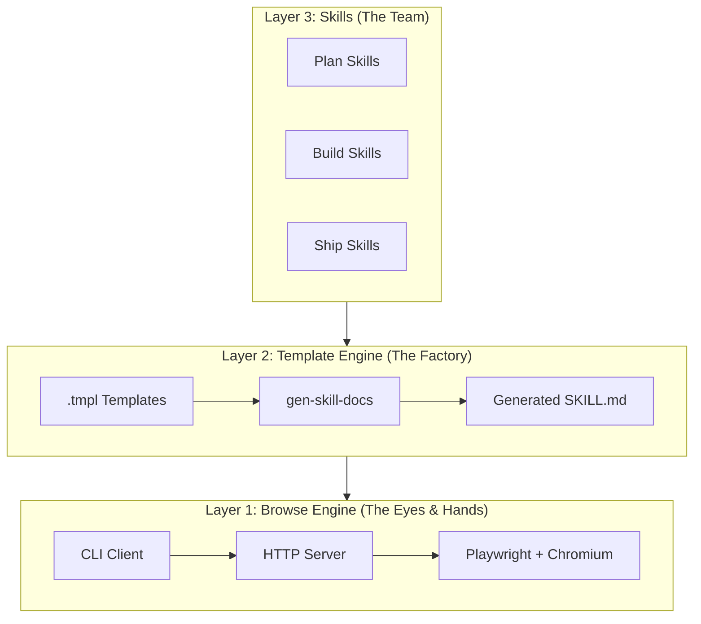
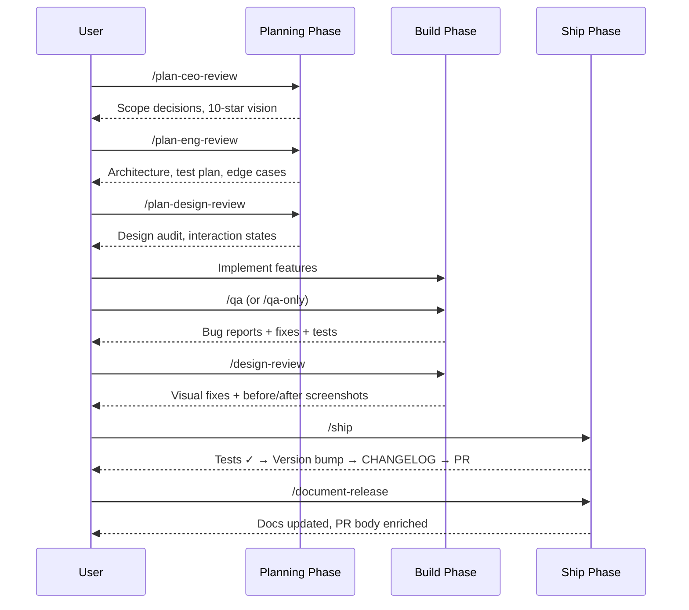

# Chapter 1: Architecture Overview

Welcome to the gstack tutorial! In this first chapter, we'll explore the big picture — what gstack is, why it exists, and how its pieces fit together. By the end, you'll have a mental map of the entire system.

## What Problem Does gstack Solve?

Imagine you're building a web application. You need someone to plan the architecture, someone to review the design, someone to write tests, someone to QA the live site, someone to review the code, and someone to ship it. That's a whole team — and coordinating them takes time.

gstack turns **one Claude Code session** into that entire team. Each "team member" is a **skill** — a Markdown-based workflow prompt that gives Claude a specific role, personality, and checklist. And they all share a secret weapon: a persistent headless browser that can click buttons, fill forms, and take screenshots in ~100ms.

## The Virtual Team

Here's who's on your team:

| Role | Skill | What They Do |
|------|-------|-------------|
| CEO/Founder | `/plan-ceo-review` | Rethink the problem, find 10-star products |
| Eng Manager | `/plan-eng-review` | Lock architecture, edge cases, test plans |
| Senior Designer | `/plan-design-review` | 80-item design audit, AI slop detection |
| QA Engineer | `/browse` | Headless browser: real clicks, real screenshots |
| QA Lead | `/qa`, `/qa-only` | Find bugs, generate regression tests |
| Designer Who Codes | `/design-review` | Visual QA + atomic CSS fixes |
| Staff Engineer | `/review` | Find bugs that pass CI |
| Release Engineer | `/ship` | Tests → version bump → CHANGELOG → PR |
| Technical Writer | `/document-release` | Update all docs post-ship |
| Eng Manager (Retro) | `/retro` | Weekly retro with trends and streaks |

## The Three Layers

gstack has three architectural layers, each building on the one below:



### Layer 1: Browse Engine (The Eyes & Hands)

At the foundation is a **persistent headless browser** — a Chromium instance managed by Playwright, exposed as a CLI tool. When a skill needs to visit a page, click a button, or take a screenshot, it calls the browse binary (`$B`).

The key insight is **persistence**. The browser stays running between commands. First call takes ~3 seconds (startup); every subsequent call takes ~100-200ms. This makes real browser testing practical inside AI workflows.

**Key files:**
- `browse/src/cli.ts` — CLI wrapper that talks to the server
- `browse/src/server.ts` — HTTP daemon that manages Chromium
- `browse/src/browser-manager.ts` — Lifecycle, tabs, refs, dialogs
- `browse/src/snapshot.ts` — Accessibility tree extraction

→ Deep dive: [Chapter 2: Browse Engine](02_browse_engine.md)

### Layer 2: Template Engine (The Factory)

Skills are written as `.tmpl` template files containing Markdown with `{{PLACEHOLDER}}` tokens. At build time, `gen-skill-docs.ts` resolves these placeholders — pulling command references from `commands.ts`, snapshot flags from `snapshot.ts`, and shared methodology blocks from the generator itself.

This means skill documentation is **always in sync** with the source code. Add a new browse command → rebuild → every skill that references commands gets updated.

**Key files:**
- `scripts/gen-skill-docs.ts` — Template compiler
- `SKILL.md.tmpl` — Root skill template
- `{skill-dir}/SKILL.md.tmpl` — Per-skill templates

→ Deep dive: [Chapter 6: Template Engine](06_template_engine.md)

### Layer 3: Skills (The Team)

Each skill is a generated `SKILL.md` file that Claude reads when you invoke a slash command. Skills define:
- **Who** Claude is (role, personality, cognitive patterns)
- **What** Claude should do (step-by-step workflow)
- **How** Claude should decide (decision frameworks, AskUserQuestion format)
- **When** to stop (completion criteria, risk heuristics)

→ Deep dive: [Chapter 5: Skill System](05_skill_system.md)

## The Development Workflow

A typical gstack-powered development cycle looks like this:



## Project Structure

Here's how the codebase is organized:

```
gstack/
├── browse/              # Layer 1: Headless browser engine
│   ├── src/             # 14 TypeScript source files
│   │   ├── cli.ts       # CLI client
│   │   ├── server.ts    # HTTP daemon
│   │   ├── commands.ts  # Command registry (single source of truth)
│   │   └── snapshot.ts  # Accessibility tree + @ref system
│   ├── test/            # Browser integration tests
│   └── dist/            # Compiled ~58MB binary
│
├── scripts/             # Layer 2: Build tooling
│   ├── gen-skill-docs.ts    # Template → SKILL.md compiler
│   ├── skill-check.ts       # Health dashboard
│   └── dev-skill.ts         # Watch mode for template development
│
├── {14 skill dirs}/     # Layer 3: One directory per skill
│   ├── SKILL.md.tmpl    # Template (human-edited)
│   └── SKILL.md         # Generated (committed, never hand-edited)
│
├── test/                # 3-tier test infrastructure
│   ├── helpers/         # Parser, runner, judge, eval store
│   └── fixtures/        # Ground truth, planted bugs, HTML fixtures
│
├── bin/                 # Helper scripts (update check, config, etc.)
├── CLAUDE.md            # Development instructions
└── package.json         # Build scripts + dependencies
```

## Key Design Decisions

### Why Bun?

gstack compiles to a single ~58MB binary using `bun build --compile`. No `node_modules` at runtime. Bun also provides:
- Native SQLite (for cookie decryption)
- Native TypeScript (no compilation step)
- ~1ms startup (vs ~100ms for Node)
- Built-in HTTP server

### Why Markdown Skills?

Skills are Markdown because Claude reads Markdown. There's no runtime, no SDK, no framework — just a `.md` file that tells Claude what to do. This makes skills:
- **Readable** by humans and AI alike
- **Versionable** in git
- **Testable** via static validation, E2E sessions, and LLM judges
- **Composable** via template placeholders

### Why a Persistent Server?

Most browser automation tools start and stop a browser for each test. gstack keeps one Chromium instance running, with an HTTP server in front of it. This gives you:
- **Sub-second commands** after the initial ~3s startup
- **Shared state** (cookies, tabs, localStorage) across commands
- **Crash recovery** — the CLI detects a dead server and auto-restarts

### Why Committed Generated Files?

The generated `SKILL.md` files are committed to git (not `.gitignore`d) because:
1. Claude reads `SKILL.md` at skill load time — no build step needed
2. CI can validate freshness (`gen:skill-docs --dry-run`)
3. `git blame` works on the generated output

## What's Next?

Now that you have the big picture, let's dive into the foundation — the browse engine that gives gstack its "eyes and hands."

→ Next: [Chapter 2: Browse Engine](02_browse_engine.md)

