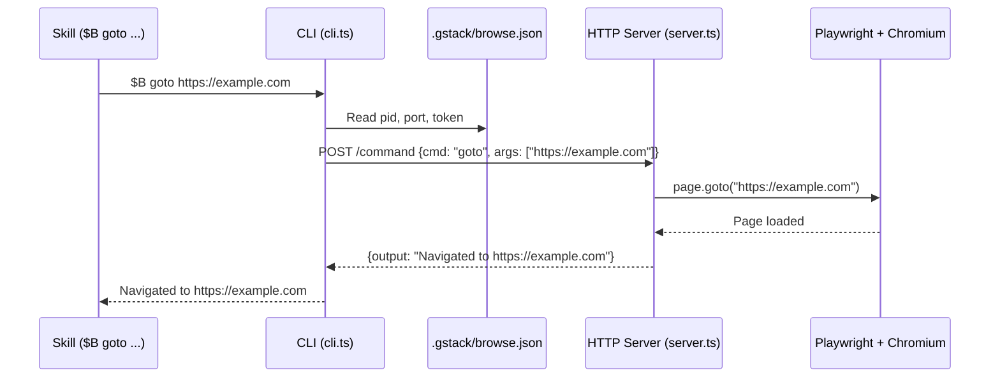
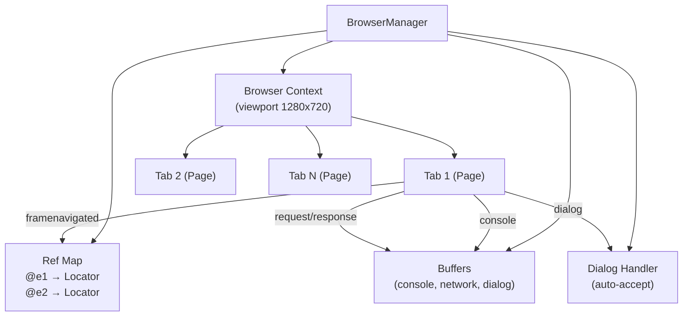
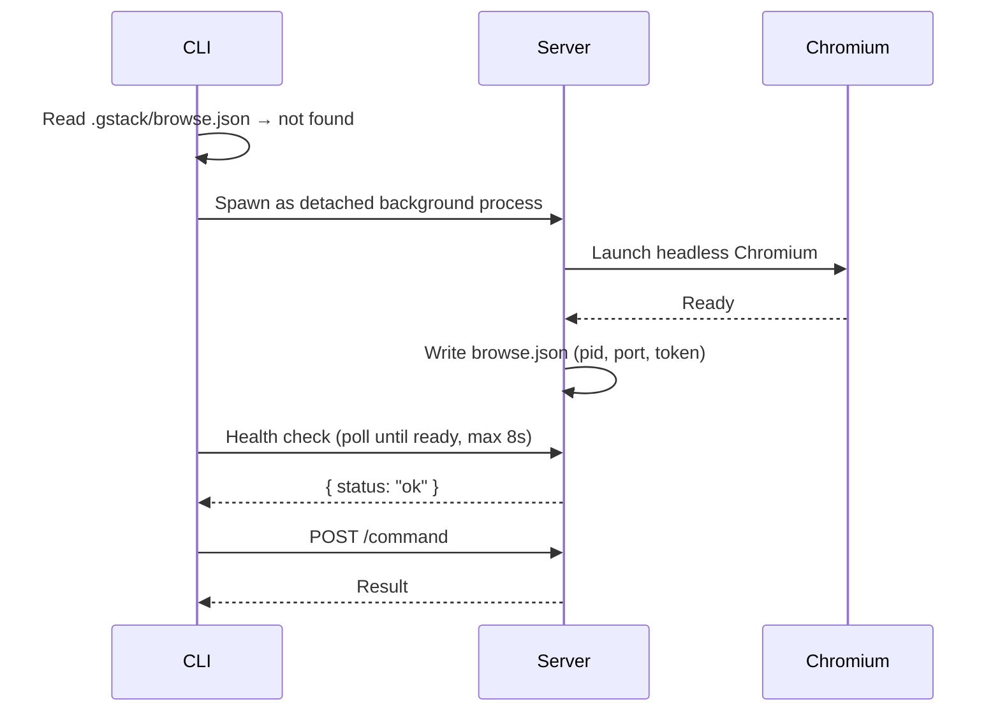
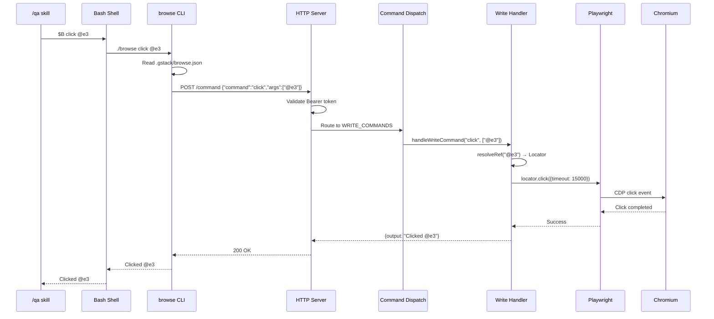

# Chapter 2: Browse Engine

Welcome to the browse engine — the foundation that gives gstack its ability to see and interact with real web pages. If the skills are the "brains" of your virtual team, the browse engine is the "eyes and hands."

## What Problem Does This Solve?

When an AI agent needs to test a web application, it typically has two options: read the source code and guess what the UI looks like, or use slow, fragile browser tools that take seconds per interaction.

gstack's browse engine solves this with a **persistent Chromium daemon**. The browser starts once and stays running. Every subsequent command — clicking a button, reading text, taking a screenshot — completes in ~100-200ms. This makes real browser testing practical inside AI workflows where you might need dozens of interactions.

Think of it like the difference between starting your car's engine every time you want to move vs. leaving it idling. The first approach wastes time; the second lets you react instantly.

## Client-Server Architecture

The browse engine uses a classic client-server pattern:



### The CLI (`browse/src/cli.ts`)

The CLI is a **thin wrapper** — it doesn't touch the browser directly. Instead, it:

1. Reads the state file (`.gstack/browse.json`) to find the server
2. Starts the server if it's not running
3. Sends an HTTP POST to `/command`
4. Prints the response

```typescript
// Simplified from cli.ts
async function sendCommand(port: number, token: string, cmd: string, args: string[]) {
  const response = await fetch(`http://127.0.0.1:${port}/command`, {
    method: 'POST',
    headers: {
      'Content-Type': 'application/json',
      'Authorization': `Bearer ${token}`,
    },
    body: JSON.stringify({ command: cmd, args }),
  });
  return response.json();
}
```

The state file looks like this:

```json
{
  "pid": 12345,
  "port": 34567,
  "token": "a1b2c3d4-e5f6-...",
  "startedAt": "2026-03-18T10:00:00Z",
  "binaryVersion": "716e4c9"
}
```

### The Server (`browse/src/server.ts`)

The server is a `Bun.serve()` HTTP daemon that:
- Listens on a random port (10000-60000)
- Authenticates requests via Bearer token
- Dispatches commands to the appropriate handler
- Auto-shuts down after 30 minutes of idle time

```typescript
// Simplified from server.ts
const server = Bun.serve({
  port: randomPort(),
  async fetch(req) {
    if (new URL(req.url).pathname === '/health') {
      return Response.json({ status: 'ok', uptime, tabs, currentUrl });
    }

    if (!validateAuth(req)) {
      return new Response('Unauthorized', { status: 401 });
    }

    const { command, args } = await req.json();

    if (READ_COMMANDS.has(command))  return handleReadCommand(command, args);
    if (WRITE_COMMANDS.has(command)) return handleWriteCommand(command, args);
    if (META_COMMANDS.has(command))  return handleMetaCommand(command, args);

    return Response.json({ error: `Unknown command: ${command}` });
  },
});
```

### The Browser Manager (`browse/src/browser-manager.ts`)

The `BrowserManager` class wraps Playwright's browser context and adds:

- **Tab management** — open, close, switch between tabs
- **Ref map** — maps `@e1`, `@e2` references to Playwright Locators (see [Chapter 3](03_snapshot_and_refs.md))
- **Dialog handling** — auto-accepts `alert()`/`confirm()`/`prompt()` to prevent lockups
- **Event wiring** — captures console logs, network requests, and navigation events



## Lifecycle: Start → Command → Idle Shutdown

Here's how the entire lifecycle works:

### 1. First Command (~3 seconds)

When no server is running, the CLI starts one:



### 2. Subsequent Commands (~100-200ms)

The server is already running. The CLI reads the state file, verifies the process is alive, and sends the command directly.

### 3. Idle Shutdown (30 minutes)

After 30 minutes with no commands, the server shuts itself down. The next command will trigger a fresh start.

### 4. Crash Recovery

If Chromium crashes, the server exits immediately (`process.exit(1)`). The CLI detects the dead process on the next command and auto-restarts.

```typescript
// From browser-manager.ts — fail-fast, no self-healing
browser.on('disconnected', () => {
  process.exit(1);
});
```

This **fail-fast** design is intentional. Rather than trying to recover from a corrupted browser state, gstack exits cleanly and lets the CLI start fresh.

### 5. Binary Version Mismatch

When the browse binary is rebuilt, the CLI detects the version mismatch (git SHA in `.version` file) and auto-restarts the server with the new binary.

## Circular Buffers: Console, Network, Dialog

The server captures three streams of browser events in **circular buffers** — fixed-size ring buffers that overwrite the oldest entries when full:

```typescript
// From buffers.ts
class CircularBuffer<T> {
  private items: (T | undefined)[];
  private head = 0;
  private _size = 0;
  private _totalAdded = 0;

  push(entry: T) {
    this.items[this.head] = entry;
    this.head = (this.head + 1) % this.capacity;
    if (this._size < this.capacity) this._size++;
    this._totalAdded++;
  }

  last(n: number): T[] { /* return most recent n entries */ }
}
```

Each buffer holds up to **50,000 entries** and flushes to disk every second:

| Buffer | File | Entry Type |
|--------|------|-----------|
| Console | `.gstack/browse-console.log` | `{ timestamp, level, text }` |
| Network | `.gstack/browse-network.log` | `{ method, url, status, duration, size }` |
| Dialog | `.gstack/browse-dialog.log` | `{ type, message, action, response }` |

Flush failures are **non-fatal** — the buffers persist in memory even if disk writes fail. This ensures that browser commands never hang because of a logging issue.

## Security Model

The browse engine has several security layers:

| Layer | What It Protects |
|-------|-----------------|
| **Localhost only** | Server binds to `127.0.0.1`, never `0.0.0.0` |
| **Bearer token** | Random UUID in state file (mode `0o600`, owner-only) |
| **Path validation** | File I/O restricted to `/tmp` and `process.cwd()` — no `..` traversal |
| **No shell injection** | Hardcoded browser paths; `Bun.spawn()` with argument arrays |
| **Cookie security** | Values truncated in all logs; keychain keys cached per-session only |

## Configuration (`browse/src/config.ts`)

The config system resolves paths in this priority:

1. `BROWSE_STATE_FILE` environment variable (set by CLI for server)
2. Git root → `<project-root>/.gstack/`
3. Current working directory fallback (non-git environments)

```typescript
// Simplified from config.ts
function resolveConfig(): BrowseConfig {
  const gitRoot = getGitRoot();  // git rev-parse --show-toplevel
  const projectDir = gitRoot ?? process.cwd();
  const stateDir = path.join(projectDir, '.gstack');

  return {
    projectDir,
    stateDir,
    stateFile: path.join(stateDir, 'browse.json'),
    consoleLog: path.join(stateDir, 'browse-console.log'),
    networkLog: path.join(stateDir, 'browse-network.log'),
    dialogLog: path.join(stateDir, 'browse-dialog.log'),
  };
}
```

## How It Works Under the Hood

Let's trace a complete command — from skill invocation to browser action and back:



Key things to notice:
1. **The `$B` alias** — skills invoke the browse binary via `$B`, which is resolved to the actual binary path at skill load time
2. **Ref resolution** — `@e3` is looked up in the ref map (set by the last `snapshot` command) to get a Playwright Locator
3. **Timeout** — all interactions have a 15-second timeout with AI-friendly error messages
4. **Error wrapping** — Playwright errors are translated into messages like "Ref @e3 is stale. Run `snapshot` to get fresh refs."

## What's Next?

Now that you understand the browse engine's architecture, let's look at how the snapshot system gives AI agents a structured view of web pages.

→ Next: [Chapter 3: Snapshot & Ref System](03_snapshot_and_refs.md)

