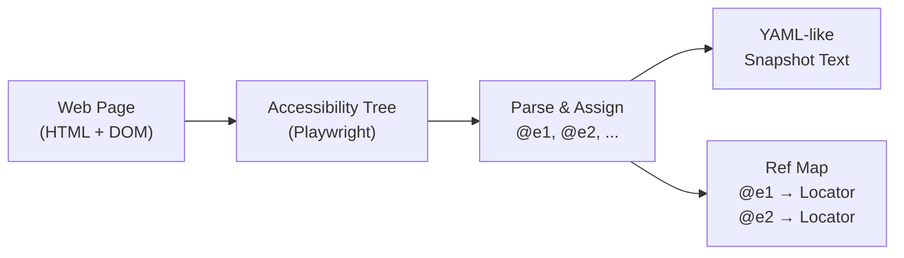
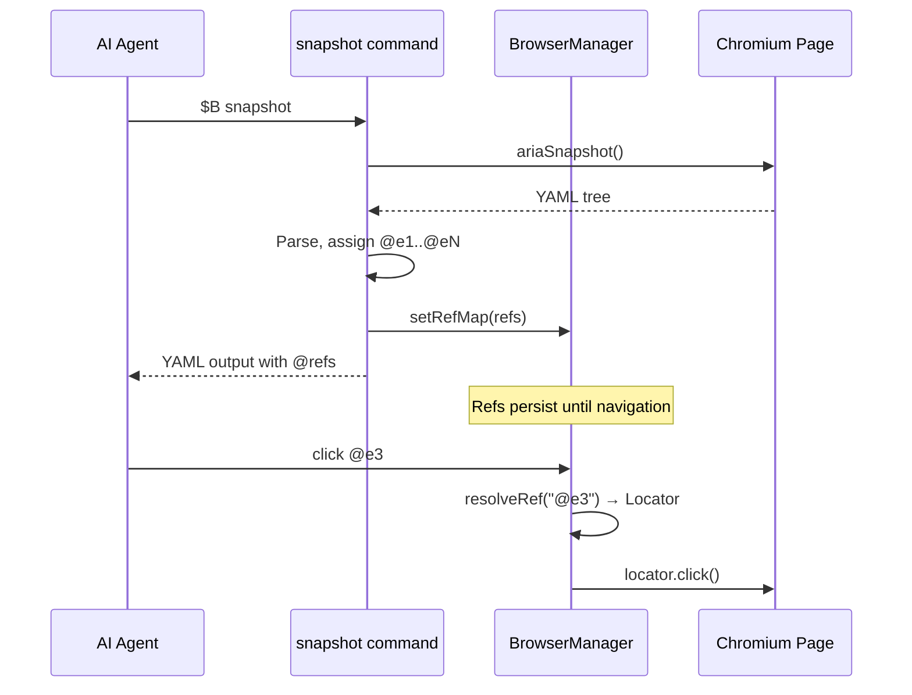
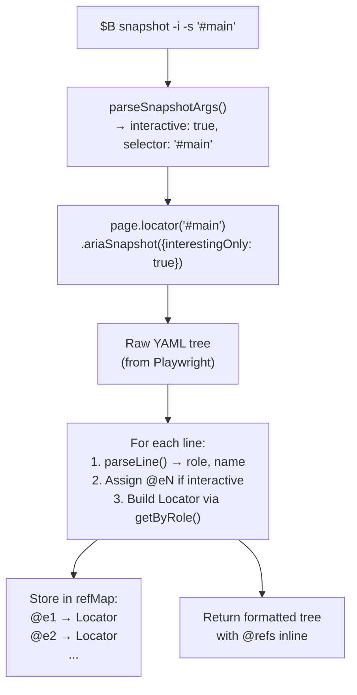

# Chapter 3: Snapshot & Ref System

Welcome to the snapshot system — the mechanism that lets AI agents "see" a web page's structure and interact with specific elements by name. If the browse engine is gstack's "eyes and hands," the snapshot system is the "map" that tells the hands where to reach.

## What Problem Does This Solve?

When a human looks at a web page, they immediately see buttons, links, form fields, and headings. They can point and say "click that blue button." An AI agent, on the other hand, gets raw HTML — thousands of nested `<div>` tags with no obvious way to identify what matters.

The snapshot system solves this by extracting the page's **accessibility tree** (the same structure screen readers use) and assigning **numbered references** like `@e1`, `@e2`, `@e3` to each interactive or meaningful element. The agent can then say `click @e3` instead of writing a fragile CSS selector.

Think of it like a theater program. Instead of saying "the person in the red shirt, third from the left," you can say "Actor #3." Simple, unambiguous, and fast.

## A Simple Example

Here's what happens when you run `$B snapshot` on a login page:

```
- heading "Sign In" [level=1]
- textbox "Email" @e1
- textbox "Password" @e2
- button "Sign In" @e3
- link "Forgot password?" @e4
- paragraph: Don't have an account?
  - link "Sign up" @e5
```

Now the agent can:
```bash
$B fill @e1 "user@example.com"
$B fill @e2 "hunter2"
$B click @e3
```

No CSS selectors. No XPath. No fragile DOM queries. Just meaningful references that map directly to what a user would see.

## How Snapshots Work

The snapshot system is built on Playwright's `page.accessibility.snapshot()`, which returns the browser's accessibility tree — the same tree that assistive technologies use.



### Step 1: Extract the Accessibility Tree

Playwright's `ariaSnapshot()` method returns a YAML-like representation of the page's semantic structure:

```typescript
// From snapshot.ts
const tree = await page.locator(scope).ariaSnapshot({ interestingOnly });
```

The `interestingOnly` parameter (toggled by the `-i` flag) controls whether to include all elements or just interactive ones (buttons, links, inputs, etc.).

### Step 2: Parse and Assign Refs

Each line of the tree is parsed to identify its role and name. Interactive elements get sequential `@e` references:

```typescript
// Simplified from snapshot.ts
let refCounter = 0;
const refMap = new Map<string, RefEntry>();

for (const line of treeLines) {
  const { role, name, depth } = parseLine(line);

  if (isInteractive(role)) {
    refCounter++;
    const ref = `@e${refCounter}`;
    const locator = buildLocator(page, role, name);
    refMap.set(ref, { locator, role, name });
    // Append ref to the output line
  }
}
```

### Step 3: Build Playwright Locators

For each ref, the system builds a Playwright Locator using `getByRole()`. When multiple elements have the same role and name, it uses `.nth()` for disambiguation:

```typescript
// Build a locator for "button named Submit"
const locator = page.getByRole('button', { name: 'Submit' });

// If there are two "Submit" buttons, use nth()
const locator = page.getByRole('button', { name: 'Submit' }).nth(1);
```

This approach is **external to the DOM** — no JavaScript is injected into the page, no CSP issues, no framework conflicts.

### Step 4: Store in Ref Map

The ref map is stored in the `BrowserManager` and persists until the next navigation event:



## Ref Resolution and Staleness

When a command uses an `@e` reference, the browser manager resolves it:

```typescript
// From browser-manager.ts
resolveRef(selector: string) {
  if (selector.startsWith('@e') || selector.startsWith('@c')) {
    const entry = this.refMap.get(selector);
    if (!entry) throw new Error(`Unknown ref: ${selector}`);

    // Staleness check: is the element still in the DOM?
    const count = await entry.locator.count();
    if (count === 0) {
      throw new Error(`Ref ${selector} is stale. Run \`snapshot\` to get fresh refs.`);
    }

    return entry.locator;
  }

  // Fall back to CSS selector
  return page.locator(selector);
}
```

Refs become **stale** when the page navigates (the `framenavigated` event clears the ref map). This is intentional — after navigation, the DOM has changed, so old refs might point to the wrong elements.

**The rule is simple:** after any navigation (clicking a link, submitting a form, calling `goto`), run `snapshot` again to get fresh refs.

## Snapshot Flags

The snapshot command supports several flags that control what you see:

| Flag | Short | Description | Example |
|------|-------|------------|---------|
| `--interactive` | `-i` | Only show interactive elements (buttons, links, inputs) | `$B snapshot -i` |
| `--compact` | `-c` | Remove empty structural nodes | `$B snapshot -c` |
| `--depth` | `-d N` | Limit tree depth | `$B snapshot -d 3` |
| `--selector` | `-s sel` | Scope to a CSS selector | `$B snapshot -s "#main"` |
| `--diff` | `-D` | Show unified diff vs. previous snapshot | `$B snapshot -D` |
| `--annotate` | `-a` | Take screenshot with red overlay boxes at each ref | `$B snapshot -a` |
| `--output` | `-o path` | Save annotated screenshot to file | `$B snapshot -a -o /tmp/snap.png` |
| `--cursor-interactive` | `-C` | Include `@c` refs for cursor:pointer/onclick elements | `$B snapshot -C` |

These flags are defined in the `SNAPSHOT_FLAGS` metadata array in `browse/src/snapshot.ts` — the single source of truth used by both the CLI parser and the documentation generator.

### Interactive-Only Mode (`-i`)

For complex pages with hundreds of elements, `-i` filters down to just the interactive ones:

```
Full snapshot (150 elements):
- banner
  - navigation "Main"
    - list
      - listitem
        - link "Home" @e1
        - link "Products" @e2
      ...

Interactive-only (12 elements):
- link "Home" @e1
- link "Products" @e2
- textbox "Search" @e3
- button "Search" @e4
...
```

### Diff Mode (`-D`)

After making a change (clicking a button, filling a form), you can see exactly what changed:

```bash
$B snapshot          # Baseline
$B click @e3         # Make a change
$B snapshot -D       # See what's different
```

Output:
```diff
- button "Submit" @e3
+ paragraph: "Form submitted successfully!"
+ link "Back to home" @e4
```

### Annotated Screenshots (`-a`)

The `-a` flag takes a screenshot and overlays red boxes at each ref's location — perfect for visual debugging:

```bash
$B snapshot -a -o /tmp/annotated.png
```

This uses Playwright's `boundingBox()` to locate each ref on screen, then draws the overlay.

## Cursor-Interactive Refs (`@c`)

Some elements are interactive via CSS (`cursor: pointer`) or JavaScript (`onclick`) but don't have proper ARIA roles. The `-C` flag scans for these and assigns separate `@c` references:

```
- button "Menu" @e1
- [cursor-interactive] div.card @c1
- [cursor-interactive] span.tag @c2
- link "More" @e2
```

This catches the "invisible interactive" elements that the accessibility tree misses — common in custom components and SPA frameworks.

## How It Works Under the Hood

Let's trace the full flow of a snapshot command:



The key insight is that Playwright's Locators are **not CSS selectors** — they're live references that Playwright resolves at interaction time. This means they work even when:
- The element's position in the DOM changes (dynamic layouts)
- CSS classes are renamed (style refactors)
- The page uses Shadow DOM (web components)

They only break when the element is **removed from the DOM entirely** — which the staleness check catches.

## Practical Patterns

### Pattern 1: Navigate and Explore
```bash
$B goto https://myapp.com
$B snapshot -i                    # See interactive elements
$B click @e3                      # Click a nav link
$B snapshot -i                    # Fresh refs after navigation
```

### Pattern 2: Fill a Form
```bash
$B snapshot -s "form"             # Scope to the form
$B fill @e1 "John Doe"
$B fill @e2 "john@example.com"
$B click @e3                      # Submit
$B snapshot -D                    # See what changed
```

### Pattern 3: Visual Verification
```bash
$B snapshot -a -o /tmp/before.png # Annotated screenshot
$B click @e5                      # Make a change
$B snapshot -a -o /tmp/after.png  # Compare visually
```

### Pattern 4: Complex Page Debugging
```bash
$B snapshot -d 2                  # Shallow view (top 2 levels)
$B snapshot -s "#sidebar" -c      # Compact sidebar view
$B snapshot -C                    # Include cursor-interactive elements
```

## What's Next?

Now that you understand how gstack sees and references page elements, let's explore the full command system — all the read, write, and meta commands available.

→ Next: [Chapter 4: Command System](04_command_system.md)

