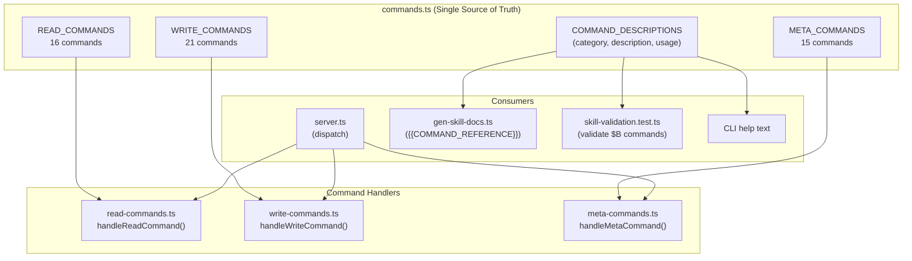

# Chapter 4: Command System

Welcome to the command system — the complete set of operations you can perform with the browse engine. In the previous chapters, you learned how the [browse engine](02_browse_engine.md) works and how the [snapshot system](03_snapshot_and_refs.md) identifies page elements. Now let's explore every command available.

## What Problem Does This Solve?

An AI agent testing a web application needs to do three things: **read** page state (is the text correct? what links exist?), **write** to the page (click buttons, fill forms, navigate), and perform **meta** operations (manage tabs, take screenshots, chain commands). The command system provides a clean, categorized interface for all of these.

## The Command Registry

All commands are defined in a single file: `browse/src/commands.ts`. This is the **single source of truth** — it's used by the CLI help text, the documentation generator, the test validator, and the server's dispatch logic.

```typescript
// From commands.ts — three exhaustive sets
export const READ_COMMANDS = new Set([
  'text', 'html', 'links', 'forms', 'accessibility', 'js', 'eval',
  'css', 'attrs', 'console', 'network', 'cookies', 'storage',
  'perf', 'dialog', 'is'
]);

export const WRITE_COMMANDS = new Set([
  'goto', 'back', 'forward', 'reload', 'click', 'fill', 'select',
  'hover', 'type', 'press', 'scroll', 'wait', 'viewport', 'cookie',
  'cookie-import', 'cookie-import-browser', 'header', 'useragent',
  'upload', 'dialog-accept', 'dialog-dismiss'
]);

export const META_COMMANDS = new Set([
  'tabs', 'tab', 'newtab', 'closetab', 'status', 'stop', 'restart',
  'screenshot', 'pdf', 'responsive', 'chain', 'diff', 'url', 'snapshot'
]);
```

Each command also has metadata in `COMMAND_DESCRIPTIONS`:

```typescript
export const COMMAND_DESCRIPTIONS: Record<string, CommandDescription> = {
  goto: {
    category: 'navigation',
    description: 'Navigate to a URL',
    usage: '$B goto <url>',
  },
  click: {
    category: 'interaction',
    description: 'Click an element',
    usage: '$B click <@ref|selector>',
  },
  // ... 50+ commands
};
```

A **load-time validation** ensures that every command in the three sets has a description, and vice versa. If you add a command but forget its description, the binary won't start.

## Read Commands

Read commands extract data from the page without side effects. They never change anything.

### Text and HTML

```bash
$B text                    # Clean page text (strips script/style/noscript/svg)
$B text "#main"            # Text from a specific element
$B html                    # Full page HTML
$B html ".card"            # HTML of a specific element
```

The `text` command uses a custom `getCleanText()` function that strips `<script>`, `<style>`, `<noscript>`, and `<svg>` tags before extracting text — giving you what a user would actually read.

### Links and Forms

```bash
$B links                   # All links as "text → href"
$B forms                   # Form fields + options as JSON (passwords redacted)
```

The `forms` command is particularly useful for QA — it returns structured data about every form field, including select options and their values:

```json
{
  "form": "#login-form",
  "fields": [
    { "type": "email", "name": "email", "label": "Email", "value": "" },
    { "type": "password", "name": "password", "label": "Password", "value": "***" },
    { "type": "select", "name": "role", "options": ["Admin", "User", "Guest"] }
  ]
}
```

### JavaScript Execution

```bash
$B js "document.title"                          # Simple expression
$B js "await fetch('/api/user').then(r=>r.json())"  # Async expression
$B eval /tmp/test-script.js                     # Run a file
```

The `js` command is smart about wrapping:
- Simple expressions are evaluated directly
- Code with `await` is wrapped in an async IIFE
- Multi-line code with statements gets a block wrapper

```typescript
// From read-commands.ts — smart wrapping logic
function wrapForEvaluate(code: string): string {
  if (hasAwait(code)) {
    if (needsBlockWrapper(code)) {
      return `(async () => { ${code} })()`;
    }
    return `(async () => (${code}))()`;
  }
  return code;
}
```

The `eval` command loads JavaScript from a file — but **path validation** restricts it to `/tmp` and `process.cwd()` only:

```typescript
const SAFE_DIRECTORIES = ['/tmp', process.cwd()];
```

### Element Inspection

```bash
$B css ".header" "background-color"    # Computed CSS property
$B attrs "@e3"                          # All attributes as JSON
$B is visible ".modal"                  # State check (true/false)
$B is enabled "@e5"                     # State: visible/hidden/enabled/disabled/checked/editable/focused
```

### Browser State

```bash
$B console                  # Console log entries
$B console --errors         # Errors only
$B console --clear          # Clear buffer
$B network                  # Network requests with status/duration/size
$B network --clear          # Clear buffer
$B cookies                  # All cookies as JSON
$B storage                  # localStorage + sessionStorage
$B storage set myKey myVal  # Write to localStorage
$B perf                     # Navigation timings (DNS, TTFB, DOM ready, etc.)
$B dialog                   # Dialog messages (alert/confirm/prompt)
```

The `perf` command returns detailed navigation timings:

```
DNS lookup:     12ms
TCP connect:    8ms
SSL handshake:  15ms
TTFB:           142ms
Download:       23ms
DOM parse:      45ms
DOM ready:      210ms
Load:           380ms
```

## Write Commands

Write commands change page state — navigation, interaction, configuration.

### Navigation

```bash
$B goto https://example.com     # Navigate (waits for domcontentloaded)
$B back                          # Browser back
$B forward                       # Browser forward
$B reload                        # Reload page
```

The `goto` command waits for `domcontentloaded` with a 15-second timeout. Timeout errors are translated into AI-friendly messages.

### Interaction

```bash
$B click @e3                     # Click an element
$B fill @e1 "john@example.com"  # Fill an input field
$B select @e2 "Option B"        # Select a dropdown option
$B hover @e4                     # Hover over an element
$B type "Hello, world!"         # Type into the focused element
$B press Enter                   # Press a key (Enter, Tab, Escape, arrows)
$B press Shift+Tab               # Key combinations
$B scroll @e5                    # Scroll element into view
$B scroll                        # Scroll to page bottom
$B upload @e6 /tmp/photo.jpg    # Upload a file
```

**Smart click routing:** If you click an `<option>` element, the command auto-routes to `selectOption()` on the parent `<select>`:

```typescript
// From write-commands.ts — option auto-routing
const tagName = await element.evaluate(el => el.tagName.toLowerCase());
if (tagName === 'option') {
  const selectEl = await element.evaluate(el => {
    const select = el.closest('select');
    return select ? true : false;
  });
  if (selectEl) {
    // Auto-route to selectOption()
  }
}
```

### Wait Conditions

```bash
$B wait ".loading-spinner"          # Wait for element to appear
$B wait --networkidle               # Wait for network to settle
$B wait --load                      # Wait for load event
$B wait --domcontentloaded          # Wait for DOM ready
```

### Viewport and Headers

```bash
$B viewport 375x812                 # Set mobile viewport (iPhone)
$B viewport 768x1024                # Tablet
$B viewport 1280x720                # Desktop (default)
$B header "X-Custom: value"         # Set request header
$B useragent "Mozilla/5.0..."       # Change user agent (recreates context)
```

### Cookie Management

```bash
$B cookie "session=abc123"                    # Set cookie on current domain
$B cookie-import /tmp/cookies.json            # Import from JSON file
$B cookie-import-browser chrome               # Import from Chrome (macOS)
$B cookie-import-browser arc --domain .github.com  # Specific domain from Arc
```

The `cookie-import-browser` command decrypts cookies directly from browser databases on macOS using Keychain access and AES-128-CBC decryption. See [Chapter 2](02_browse_engine.md) for security details.

### Dialog Control

```bash
$B dialog-accept                    # Auto-accept all dialogs
$B dialog-accept "Yes please"       # Accept with prompt response
$B dialog-dismiss                   # Auto-dismiss all dialogs
```

## Meta Commands

Meta commands operate at the server level — managing tabs, taking screenshots, and orchestrating multiple commands.

### Tab Management

```bash
$B tabs                     # List all open tabs with titles
$B tab 2                    # Switch to tab 2
$B newtab https://docs.com  # Open new tab
$B closetab 3               # Close tab 3
```

### Visual Capture

```bash
$B screenshot                        # Full page screenshot (returns path)
$B screenshot --viewport             # Viewport-only (no scroll)
$B screenshot --clip 0,0,800,600     # Crop region
$B screenshot @e3                    # Element screenshot
$B screenshot /tmp/shot.png          # Save to specific path

$B pdf                               # Save as A4 PDF
$B pdf /tmp/report.pdf               # Save to specific path

$B responsive                        # Screenshots at mobile, tablet, desktop
$B responsive hero                   # With filename prefix
```

The `responsive` command takes three screenshots at standard viewport sizes:
- Mobile: 375×812
- Tablet: 768×1024
- Desktop: 1280×720

### Server Control

```bash
$B status                   # Health check (URL, tabs, PID)
$B url                      # Print current URL
$B stop                     # Shut down server
$B restart                  # Restart server
```

### Chain Command

The `chain` command runs multiple commands from a JSON array via stdin — useful for multi-step flows:

```bash
echo '[["goto","https://example.com"],["snapshot","-i"],["click","@e3"]]' | $B chain
```

Output:
```
[goto] Navigated to https://example.com
[snapshot] - link "Home" @e1 ...
[click] Clicked @e3
```

Commands execute sequentially, and results are collected with `[command]` prefixes. This is significantly faster than separate CLI invocations because it avoids per-command HTTP overhead.

### Diff Command

```bash
$B diff https://staging.app.com https://prod.app.com
```

The `diff` command navigates to two URLs, extracts clean text from both, and returns a unified diff. Great for comparing staging vs. production.

### Snapshot

```bash
$B snapshot                 # Full accessibility tree with @refs
$B snapshot -i              # Interactive elements only
$B snapshot -D              # Diff against last snapshot
```

See [Chapter 3: Snapshot & Ref System](03_snapshot_and_refs.md) for full details.

## Error Handling

Every error is translated into an **actionable message** that tells the AI agent what to do:

| Playwright Error | gstack Message |
|-----------------|----------------|
| `Timeout 15000ms exceeded` | "Timed out. The page may be slow or the URL may be wrong." |
| Stale element | "Ref @e3 is stale. Run `snapshot` to get fresh refs." |
| Unknown ref | "Unknown ref: @e99. Run `snapshot` to see available refs." |
| Click on `<option>` | "Can't click `<option>` directly. Use `browse select` instead." |
| Path traversal | "Path must be under /tmp or current working directory." |

This is a deliberate design choice — AI agents work better with clear instructions than with raw stack traces.

## How It All Fits Together



The command registry is consumed by four systems:
1. **The server** dispatches commands to the right handler
2. **The doc generator** builds command reference tables for skills
3. **The test validator** checks that skills only use valid commands
4. **The CLI** generates help text

This single-source-of-truth design means you can never have a command that exists in the code but not in the docs, or vice versa.

## What's Next?

Now that you know every command available, let's explore the skill system — the Markdown-based workflows that turn these low-level commands into high-level team behaviors.

→ Next: [Chapter 5: Skill System](05_skill_system.md)

