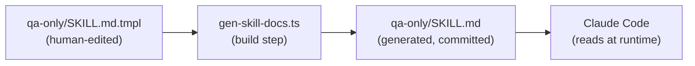
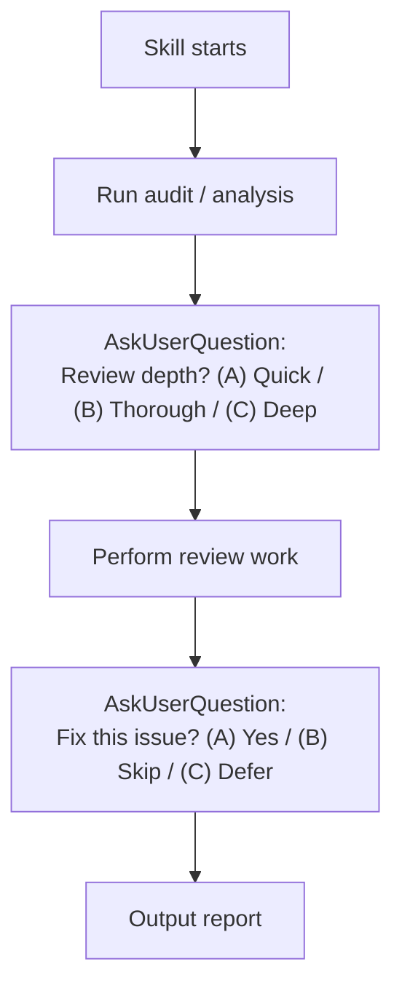
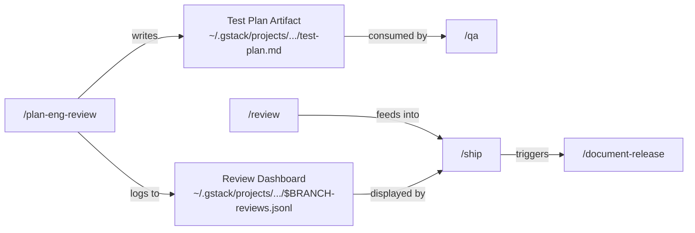

# Chapter 5: Skill System

Welcome to the skill system — the layer that transforms raw browse commands into specialized team roles. If the browse engine is the "eyes and hands" and the commands are the "vocabulary," skills are the "playbooks" that tell each team member exactly what to do.

## What Problem Does This Solve?

Having a headless browser is great, but an AI agent still needs to know *what* to do with it. Should it test login flows? Review CSS spacing? Check for accessibility issues? And in what order? With what criteria for success or failure?

Skills solve this by providing **complete workflow definitions** in Markdown. Each skill gives Claude a specific role (QA Lead, Designer, Release Engineer), a step-by-step process, decision frameworks for ambiguous situations, and clear completion criteria.

Think of skills like Standard Operating Procedures (SOPs) at a company. A new employee doesn't need to figure out the release process from scratch — they follow the SOP. Similarly, Claude doesn't need to improvise a QA workflow — it follows the skill.

## Anatomy of a Skill

Every skill is a Markdown file (`.md`) generated from a template (`.tmpl`). Here's the structure:

```
┌─────────────────────────────────────┐
│  {{PREAMBLE}}                       │  ← Standard startup block (all skills)
│  - Update check                     │
│  - Session tracking                 │
│  - AskUserQuestion format           │
│  - Completeness Principle           │
├─────────────────────────────────────┤
│  Role Definition                    │  ← Who Claude is
│  "You are a Senior QA Engineer..."  │
├─────────────────────────────────────┤
│  {{BROWSE_SETUP}}                   │  ← Browser binary discovery
│  (for browser-using skills)         │
├─────────────────────────────────────┤
│  Workflow Steps                     │  ← What to do, in order
│  Step 1: ...                        │
│  Step 2: ...                        │
│  Step N: ...                        │
├─────────────────────────────────────┤
│  Decision Frameworks                │  ← How to handle ambiguity
│  "If X, do Y. If Z, ask."          │
├─────────────────────────────────────┤
│  Completion Criteria                │  ← When you're done
│  "Output report to..."             │
└─────────────────────────────────────┘
```

## The Preamble

Every skill starts with `{{PREAMBLE}}`, which expands to a standard startup block. This is the "boot sequence" that runs before any skill-specific logic:

### 1. Update Check
```bash
gstack-update-check
```
Reports if a newer version of gstack is available.

### 2. Session Tracking
```bash
touch ~/.gstack/sessions/$PPID
```
Tracks concurrent sessions — the agent knows how many gstack sessions are active.

### 3. AskUserQuestion Format

All skills use a standardized format when asking the user a question:

```
1. Re-ground: State project, current branch, plan
2. Simplify: Explain in plain English a 16-year-old could follow
3. Recommend: Preferred option + one-line reason; show Completeness: X/10
4. Options: Lettered (A/B/C); show both human & CC time when applicable
```

This ensures that every question from every skill has the same clear, actionable structure.

### 4. The Completeness Principle

> Always recommend the complete option over shortcuts when the marginal cost of AI is near-zero.

This is gstack's core philosophy. When the agent asks "should I write 3 tests or 30?", the Completeness Principle says: recommend 30, because the incremental AI cost is negligible compared to the value of complete coverage.

## The 14 Skills

gstack provides 14 skills organized into four phases:

### Planning Phase

| Skill | Role | Key Behavior |
|-------|------|-------------|
| `/plan-ceo-review` | CEO/Founder | Challenge premises, find 10-star products, 4 scope modes |
| `/plan-eng-review` | Eng Manager | Architecture, data flow, edge cases, test plan artifact |
| `/plan-design-review` | Senior Designer | 80-item design audit (A-F grades), AI slop detection |

### Build Phase

| Skill | Role | Key Behavior |
|-------|------|-------------|
| `/browse` | QA Engineer | Raw headless browser access (~100ms commands) |
| `/qa` | QA Lead | Find bugs → fix → regression tests (atomic commits) |
| `/qa-only` | QA Reporter | Same as `/qa` but report-only — no code changes |
| `/design-review` | Designer Who Codes | Visual QA + atomic CSS fixes + before/after screenshots |
| `/design-consultation` | Design Partner | Build complete design system from scratch |

### Ship Phase

| Skill | Role | Key Behavior |
|-------|------|-------------|
| `/review` | Staff Engineer | Find bugs that pass CI, auto-fix obvious ones |
| `/ship` | Release Engineer | Tests → version bump → CHANGELOG → PR |
| `/document-release` | Technical Writer | Update all docs post-ship |

### Observability

| Skill | Role | Key Behavior |
|-------|------|-------------|
| `/retro` | Eng Manager | Weekly retro with per-person breakdowns, trends, streaks |

### Utility

| Skill | Role | Key Behavior |
|-------|------|-------------|
| `/setup-browser-cookies` | Session Manager | Import cookies from Chrome/Arc/Brave/Edge |
| `/gstack-upgrade` | Release Engineer | Detect stale installs, auto-upgrade |

## How Skills Use the Browser

Browser-using skills (browse, qa, qa-only, design-review) include `{{BROWSE_SETUP}}` which expands to binary discovery logic:

```bash
# {{BROWSE_SETUP}} resolves to something like:
B=$(find-browse)      # Locate the browse binary
if [ -z "$B" ]; then
  echo "ERROR: browse binary not found. Run setup."
  exit 1
fi
```

Then the skill uses `$B` as a shorthand for browse commands:

```bash
$B goto https://myapp.com/login
$B snapshot -i
$B fill @e1 "test@example.com"
$B fill @e2 "password123"
$B click @e3
$B snapshot -D     # What changed after login?
```

## Skill Templates vs. Generated Files

Skills are written as `.tmpl` (template) files and compiled to `.md` files:



**You never edit `.md` files directly.** Always edit the `.tmpl` and run `bun run gen:skill-docs`.

→ Deep dive: [Chapter 6: Template Engine](06_template_engine.md)

## Skill Design Rules

Skills are Markdown prompts, not bash scripts. This distinction matters because:

### 1. Each Bash Block is Independent

Variables don't persist between code blocks. This won't work:

```markdown
<!-- WRONG: $BASE won't exist in the second block -->
```bash
BASE=$(git branch --show-current)
```

Now use $BASE:
```bash
echo "Current branch: $BASE"   # $BASE is undefined!
```
```

Instead, use **natural language** to carry state:

```markdown
Detect the current branch:
```bash
git branch --show-current
```

Using the branch name from the command above, create the PR...
```

### 2. No Hardcoded Branch Names

Never write `main` literally. Use `{{BASE_BRANCH_DETECT}}` or detect dynamically:

```bash
# Detect base branch (main, master, develop, etc.)
gh repo view --json defaultBranchRef -q '.defaultBranchRef.name'
```

### 3. Conditionals as English

Instead of nested `if/elif/else` in bash:

```markdown
Decision:
1. If the test suite passes and all checks are green, proceed to version bump.
2. If tests fail, stop and report the failures.
3. If tests pass but there are lint warnings, ask the user whether to proceed.
```

### 4. Self-Contained Code Blocks

Each code block should work independently. If it needs context from a previous step, restate it:

```markdown
Step 3: Create the PR using the branch name detected in Step 1 and
the version bumped in Step 2.

```bash
# Use the values from previous steps
BRANCH=$(git branch --show-current)
VERSION=$(cat VERSION)
gh pr create --title "Release v${VERSION}" ...
```
```

## Cognitive Patterns

Some skills define **cognitive patterns** — instincts that shape how Claude thinks in that role:

### Eng Manager Patterns (from `/plan-eng-review`):
1. **State diagnosis first** — Understand where we are before deciding where to go
2. **Blast radius awareness** — How much breaks if this is wrong?
3. **Boring by default** — Use proven tech unless there's a strong reason not to
4. **Incremental delivery** — Ship small pieces that each add value
5. **Reversibility** — Prefer changes you can undo

### Designer Patterns (from `/plan-design-review`):
1. **See systems, not screens** — Every element participates in a larger pattern
2. **Empathy simulation** — What would a confused, hurried user do?
3. **Hierarchy as service** — Visual hierarchy tells users what matters most
4. **Constraint worship** — Limitations drive better design
5. **Edge case paranoia** — The empty state IS the first impression

These patterns don't just tell Claude *what* to do — they tell it *how to think* while doing it.

## Interactive Skills

Most skills are interactive — they pause at key decision points to ask the user:



The planning skills (`/plan-ceo-review`, `/plan-eng-review`, `/plan-design-review`) are especially interactive — they present findings one section at a time, pausing after each for user feedback before continuing.

## Skill Data Flows

Skills don't operate in isolation. They produce and consume artifacts:



- `/plan-eng-review` writes a **test plan artifact** → consumed by `/qa` and `/qa-only`
- Plan reviews log to a **review dashboard** (JSONL) → displayed by `/ship` as pre-flight check
- `/review` findings feed into `/ship`'s pre-landing review
- `/ship` triggers `/document-release` for post-ship docs

## What's Next?

Now that you understand how skills work, let's look at the template engine that keeps them in sync with the source code.

→ Next: [Chapter 6: Template Engine](06_template_engine.md)

