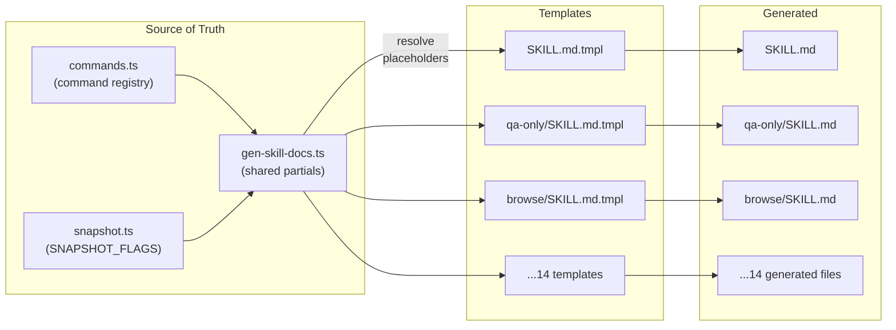
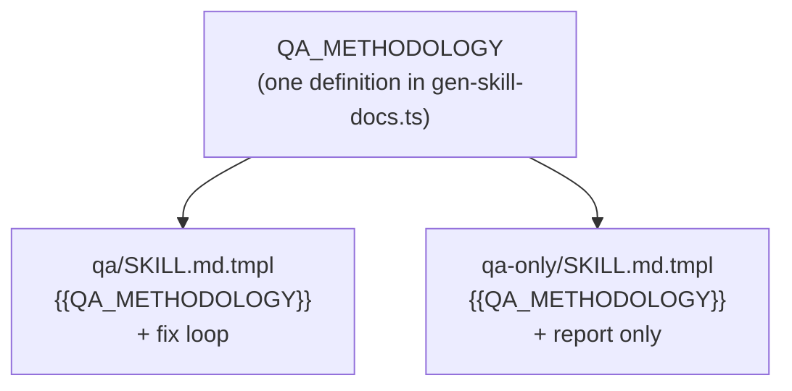
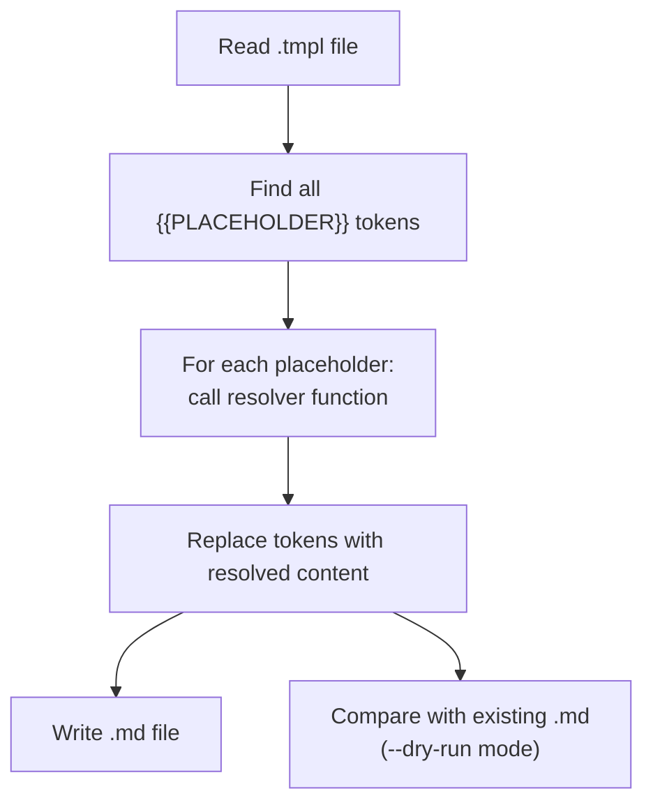

# Chapter 6: Template Engine

Welcome to the template engine — the build system that keeps skill documentation perfectly synchronized with source code. In the previous chapter, you saw that skills are Markdown files with `{{PLACEHOLDER}}` tokens. Now let's see how those tokens get resolved.

## What Problem Does This Solve?

Imagine you add a new browse command — say, `$B audio` for controlling media playback. You'd need to update:
- The command reference table in the `/browse` skill
- The command reference in `/qa` and `/qa-only`
- The validation tests
- The CLI help text

Without a template system, you'd have to update each file manually. Inevitably, one would get out of sync. With gstack's template engine, you update `commands.ts` once, run `bun run gen:skill-docs`, and every skill that references commands gets the new entry automatically.

Think of it like a mail merge. You write the letter template once, and the system fills in each recipient's details.

## The Build Pipeline



Running `bun run gen:skill-docs` (or `bun run build`):
1. Reads each `.tmpl` file
2. Finds all `{{PLACEHOLDER}}` tokens
3. Calls the appropriate resolver function
4. Writes the generated `.md` file

## Placeholder Reference

Here are all the placeholders and where their content comes from:

| Placeholder | Source | Used By |
|-------------|--------|---------|
| `{{PREAMBLE}}` | `gen-skill-docs.ts` | All 14 skills |
| `{{BROWSE_SETUP}}` | `gen-skill-docs.ts` | browse, qa, qa-only, design-review |
| `{{BASE_BRANCH_DETECT}}` | `gen-skill-docs.ts` | ship, review, qa, retro |
| `{{COMMAND_REFERENCE}}` | `commands.ts` | browse |
| `{{SNAPSHOT_FLAGS}}` | `snapshot.ts` | browse |
| `{{QA_METHODOLOGY}}` | `gen-skill-docs.ts` | qa, qa-only |
| `{{DESIGN_METHODOLOGY}}` | `gen-skill-docs.ts` | plan-design-review, design-review |
| `{{DESIGN_REVIEW_LITE}}` | `gen-skill-docs.ts` | review, ship |
| `{{REVIEW_DASHBOARD}}` | `gen-skill-docs.ts` | ship |
| `{{TEST_BOOTSTRAP}}` | `gen-skill-docs.ts` | qa, ship, design-review |

## How Resolvers Work

Each placeholder has a resolver function in `gen-skill-docs.ts`:

### `{{COMMAND_REFERENCE}}`

This reads `COMMAND_DESCRIPTIONS` from `commands.ts` and generates a categorized Markdown table:

```typescript
// Simplified from gen-skill-docs.ts
function generateCommandReference(): string {
  const grouped = groupBy(COMMAND_DESCRIPTIONS, desc => desc.category);

  let output = '';
  for (const [category, commands] of Object.entries(grouped)) {
    output += `### ${capitalize(category)}\n\n`;
    output += '| Command | Description | Usage |\n';
    output += '|---------|-------------|-------|\n';
    for (const [name, desc] of commands) {
      output += `| \`${name}\` | ${desc.description} | \`${desc.usage}\` |\n`;
    }
    output += '\n';
  }
  return output;
}
```

### `{{SNAPSHOT_FLAGS}}`

This reads the `SNAPSHOT_FLAGS` metadata array from `snapshot.ts`:

```typescript
// In snapshot.ts — single source of truth
export const SNAPSHOT_FLAGS = [
  { flag: '-i', long: '--interactive', description: 'Interactive elements only', example: '$B snapshot -i' },
  { flag: '-c', long: '--compact', description: 'Remove empty structural nodes' },
  { flag: '-d', long: '--depth', value: 'N', description: 'Limit tree depth', example: '$B snapshot -d 3' },
  // ...
];

// In gen-skill-docs.ts
function generateSnapshotFlags(): string {
  return SNAPSHOT_FLAGS.map(f => {
    const flagStr = f.long ? `\`${f.flag}\` / \`${f.long}\`` : `\`${f.flag}\``;
    const valueStr = f.value ? ` \`<${f.value}>\`` : '';
    return `| ${flagStr}${valueStr} | ${f.description} |`;
  }).join('\n');
}
```

### `{{PREAMBLE}}`

The preamble generator produces the standard startup block that all skills share:

```typescript
function generatePreamble(): string {
  return `
## Pre-flight

Run this at the start of every session:

\`\`\`bash
gstack-update-check
\`\`\`

...session tracking, AskUserQuestion format, Completeness Principle...
`;
}
```

### `{{QA_METHODOLOGY}}`

Shared between `/qa` and `/qa-only`, this generates the multi-phase QA workflow:

```typescript
function generateQAMethodology(): string {
  return `
### Phase 1: Initialize
Create output directory, detect mode...

### Phase 2: Authenticate
If auth is needed, import cookies or fill login form...

### Phase 3: Orient
Map application structure (pages, routes, navigation)...

### Phase 4: Explore
Visit pages systematically, take snapshots...

### Phase 5: Document Issues
For each issue: screenshot, repro steps, severity...

### Phase 6: Health Score
Compute overall health score (0-100)...
`;
}
```

## DRY Methodology Sharing

The template system enables **DRY (Don't Repeat Yourself)** across skills. Instead of duplicating the QA workflow in both `/qa` and `/qa-only`, both templates use `{{QA_METHODOLOGY}}`:



Similarly, `{{DESIGN_METHODOLOGY}}` is shared between `/plan-design-review` and `/design-review`, and `{{DESIGN_REVIEW_LITE}}` is shared between `/review` and `/ship`.

## Template vs. Generated: An Example

Here's what a `.tmpl` file looks like (simplified):

```markdown
<!-- qa-only/SKILL.md.tmpl -->

{{PREAMBLE}}

# QA Report

You are a Senior QA Engineer. Your job is to test the application
and produce a detailed report. **You must not modify any code.**

{{BROWSE_SETUP}}

## Workflow

{{QA_METHODOLOGY}}

## Output

Write the report to `.gstack/qa-reports/`...
```

After running `gen-skill-docs`, the generated `.md` file has all placeholders resolved — the preamble is ~50 lines, browse setup is ~20 lines, and QA methodology is ~100 lines. The `.md` file might be 200+ lines while the `.tmpl` is only 30.

## Freshness Validation

CI validates that generated files match their templates:

```bash
# In .github/workflows/skill-docs.yml
bun run gen:skill-docs --dry-run
# Exit code 1 if any .md differs from what would be generated
```

This catches two problems:
1. Someone edited a `.md` file directly (they should edit the `.tmpl`)
2. Someone changed a source file (commands.ts, snapshot.ts) but forgot to regenerate

## Development Workflow

### Adding a New Browse Command

1. Add the command to `commands.ts`:
   ```typescript
   export const READ_COMMANDS = new Set([..., 'audio']);
   COMMAND_DESCRIPTIONS['audio'] = {
     category: 'media',
     description: 'Get audio/video playback state',
     usage: '$B audio',
   };
   ```
2. Add the handler in `read-commands.ts`
3. Run `bun run gen:skill-docs` → browse SKILL.md gets the new command
4. Run `bun test` → validator confirms skills only use valid commands
5. Commit both `.tmpl` changes (if any) and generated `.md` files

### Adding a New Snapshot Flag

1. Add to `SNAPSHOT_FLAGS` in `snapshot.ts`:
   ```typescript
   { flag: '-f', long: '--filter', value: 'pattern', description: 'Filter by role name' }
   ```
2. Add parsing logic in `parseSnapshotArgs()`
3. Run `bun run gen:skill-docs` → browse SKILL.md gets the new flag
4. Commit

### Creating a New Skill

1. Create a directory: `my-skill/`
2. Create `my-skill/SKILL.md.tmpl` with `{{PREAMBLE}}` and workflow steps
3. Add the template path to `gen-skill-docs.ts`
4. Run `bun run gen:skill-docs`
5. Commit both `.tmpl` and `.md`

## Watch Mode

For rapid iteration during development:

```bash
bun run dev:skill
```

This watches `.tmpl` files, `commands.ts`, and `snapshot.ts`, and auto-regenerates + validates on every change.

## Health Dashboard

```bash
bun run skill:check
```

This scans all SKILL.md files and reports:
- Command validation (are all `$B` commands valid?)
- Template coverage (are all placeholders resolved?)
- Freshness (does `.md` match what `.tmpl` would generate?)

## How It Works Under the Hood

The generator's core loop:



Key implementation details:
- **Resolver functions are pure** — they read source files and return strings, no side effects
- **Import from source** — `commands.ts` and `snapshot.ts` are imported directly, not parsed from file
- **Committed output** — generated `.md` is committed to git so Claude reads it without a build step
- **No runtime generation** — everything is resolved at build time

## Why Not Runtime Templates?

You might wonder: why not resolve placeholders when Claude loads the skill? Three reasons:

1. **No build step needed** — `claude` reads `SKILL.md` directly, no `bun run` required
2. **CI validation** — `--dry-run` catches stale docs on every PR
3. **Git blame works** — you can trace who changed what in the generated output

The trade-off is that you must remember to regenerate after source changes. But CI catches this automatically, and `dev:skill` watch mode handles it during development.

## What's Next?

Now that you understand how skills are built, let's explore the planning skills that kick off the development workflow.

→ Next: [Chapter 7: Planning Skills](07_planning_skills.md)

