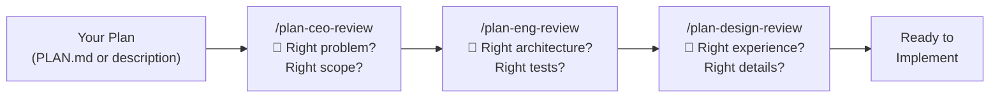
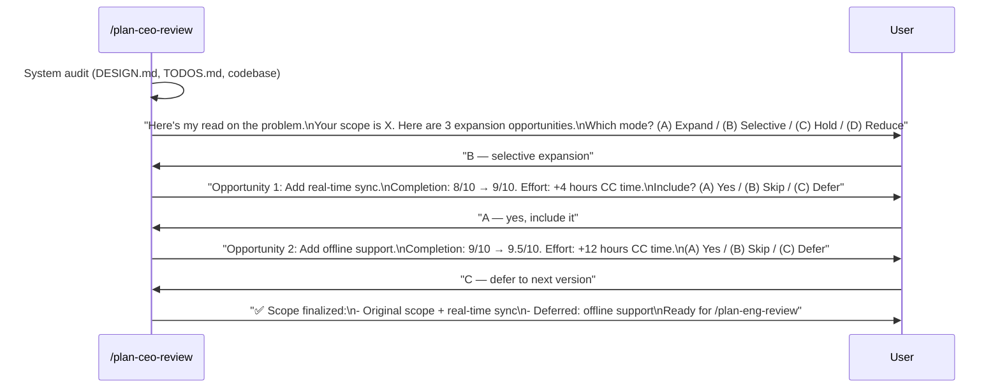
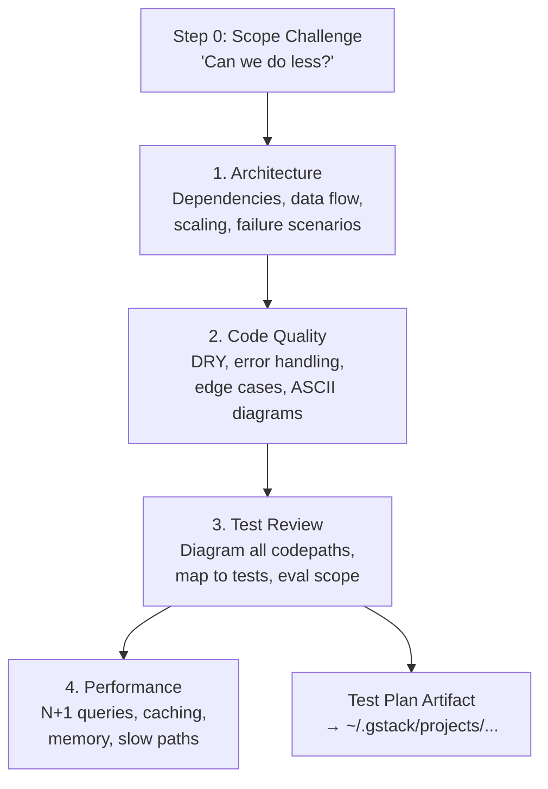

# Chapter 7: Planning Skills

Welcome to the planning skills — the trio that turns a vague idea into a locked-down execution plan. These three skills represent three different perspectives on the same plan, each catching issues the others might miss.

## What Problem Does This Solve?

Starting to code before the plan is solid is one of the most expensive mistakes in software. You build the wrong thing, miss edge cases, or discover architectural issues three days into implementation. The planning skills solve this by running three distinct reviews — CEO vision, engineering rigor, and design quality — before a single line of code is written.

Think of it like a construction project. Before breaking ground, you need:
- The **architect** (CEO review) to verify you're building the right building
- The **structural engineer** (Eng review) to verify it won't fall down
- The **interior designer** (Design review) to verify people will want to use it

## The Three Reviews



They're designed to run in sequence — CEO narrows the scope, Eng locks the architecture, Design polishes the experience. But each can also run independently.

## `/plan-ceo-review` — The CEO/Founder

**Role:** Rethink the problem. Challenge every assumption. Find the 10-star product.

This skill doesn't review code or architecture — it reviews **the problem itself**. Is this the right thing to build? Could the scope be bigger? Smaller? Different entirely?

### Four Modes

The CEO review has four operating modes, depending on what you need:

| Mode | Posture | When to Use |
|------|---------|-------------|
| **Scope Expansion** | "What would make this 10x better for 2x effort?" | Early exploration, greenfield features |
| **Selective Expansion** | Hold scope + cherry-pick opportunities | Feature is scoped, but might be missing something |
| **Hold Scope** | Maximum rigor on current scope only | Plan is final, just need a sanity check |
| **Scope Reduction** | Strip to absolute essentials | Timeline is tight, need to cut ruthlessly |

### Interactive Flow

The CEO review is deeply interactive. It presents one perspective at a time, pausing after each for your input:



### Key Behaviors
- **Challenges premises**: "Why are you building this as a separate page instead of a modal?"
- **Shows effort compression**: Every suggestion includes both human-team and CC+gstack time estimates
- **Respects the Completeness Principle**: Recommends the fuller solution when marginal AI cost is low
- **Persists decisions**: Logs scope choices to `~/.gstack/projects/{slug}/$BRANCH-reviews.jsonl`

## `/plan-eng-review` — The Engineering Manager

**Role:** Lock in execution plan. Architecture, data flow, edge cases, test coverage, performance.

While the CEO review asks "are we building the right thing?", the eng review asks "can we build it correctly?"

### Priority Hierarchy

The eng review has a strict priority order:

1. **Step 0** (scope challenge) — most important
2. **Test diagram** — codepath visualization
3. **Opinionated recommendations** — decisive, not wishy-washy
4. **Everything else**

### Step 0: Scope Challenge

Before reviewing the plan, the eng review challenges it:

- **Existing code reuse**: "This is 80% the same as `UserService` — can we extend it?"
- **Minimum changes**: "You're rewriting the auth layer, but only the token storage needs to change"
- **Complexity check**: "This introduces 3 new abstractions — do we need all of them?"
- **TODOS cross-reference**: "There's a related TODO from two weeks ago — should we combine?"
- **Completeness check**: "The plan doesn't mention error handling for the webhook endpoint"

### Four Review Sections

Each section pauses for user feedback before continuing:



### Test Plan Artifact

The eng review produces a **test plan artifact** — a Markdown file saved to `~/.gstack/projects/{slug}/{user}-{branch}-test-plan-{datetime}.md`. This artifact is consumed by `/qa` and `/qa-only` to guide their testing:

```markdown
# Test Plan: Add real-time sync

## New Codepaths
1. WebSocket connection → auth → subscribe → receive → update UI
2. Reconnection → exponential backoff → state resync
3. Conflict resolution → last-write-wins → UI notification

## Required Tests
- [ ] Connection success + message delivery
- [ ] Auth failure → graceful degradation
- [ ] Network drop → reconnect within 5s
- [ ] Conflict detection + resolution
- [ ] Memory leak check (1000 messages)
```

### Engineering Instincts

The eng review applies 15 cognitive patterns:

1. **State diagnosis first** — Understand where we are before deciding where to go
2. **Blast radius awareness** — How much breaks if this is wrong?
3. **Boring by default** — Use proven tech unless there's a strong reason not to
4. **Incremental delivery** — Ship small pieces that each add value
5. **Reversibility** — Prefer changes you can undo
6. **Systems over heroes** — If it requires heroics, the system is wrong
7. **Conway's Law** — Code structure mirrors team structure; use it intentionally
8. **DX as quality** — If it's annoying to test, it won't get tested
9. **Essential vs. accidental complexity** — Is this complexity inherent in the problem?
10. **Two-week smell test** — Will you understand this code in two weeks?

## `/plan-design-review` — The Senior Designer

**Role:** Rate design completeness 0-10. Identify missing decisions. Fix the plan before implementation.

This skill brings a designer's eye to the plan — not reviewing code, but reviewing the **user experience** described in the plan.

### The 0-10 Rating

The review starts with an honest score:

```
Current rating: 4/10

What a 10 looks like:
- Every interaction state is specified (loading, empty, error, success, partial)
- Navigation hierarchy is explicit and tested
- Responsive behavior is defined for all breakpoints
- Accessibility requirements are called out
- Empty states are designed as features, not afterthoughts

Your plan is missing:
- Loading states for the sync operation
- Error state when WebSocket disconnects
- Empty state for no messages yet
- Mobile layout specifications
```

### Seven Review Passes

Each pass focuses on a different aspect, pausing for feedback:

| Pass | Focus | Key Question |
|------|-------|-------------|
| 1 | Information Architecture | "Is the hierarchy clear? Can users find things?" |
| 2 | Interaction State Coverage | "What happens when it's loading? Empty? Error?" |
| 3 | User Journey & Emotional Arc | "Storyboard the experience — where does it feel wrong?" |
| 4 | AI Slop Risk | "Is the design specific or could any AI generate this?" |
| 5 | Design System Alignment | "Does it match the existing design system (or universal principles)?" |
| 6 | Responsive & Accessibility | "What happens on mobile? With a screen reader?" |
| 7 | Unresolved Design Decisions | "What's ambiguous? What needs a decision before coding?" |

### AI Slop Detection

Pass 4 is unique to gstack. It checks whether the plan's UI descriptions are specific enough to produce good results, or vague enough to produce "AI slop":

**Sloppy (generic):**
> "A clean, modern dashboard with cards showing key metrics"

**Specific (good):**
> "Three metric cards in a row: Active Users (green, large number + sparkline), Revenue (right-aligned currency, red/green delta badge), Errors (count with severity breakdown bar)"

The designer review pushes for specificity — the more precise the plan, the better the implementation.

### Design Thinking Instincts

The design review applies 12 cognitive patterns:

1. **See systems, not screens** — Every element participates in a larger pattern
2. **Empathy simulation** — What would a confused, hurried, frustrated user do?
3. **Hierarchy as service** — Visual hierarchy tells users what matters most
4. **Constraint worship** — Limitations drive better design
5. **Edge case paranoia** — The empty state IS the first impression
6. **Anti-AI-slop** — Specificity over vibes
7. **Subtraction default** — When in doubt, remove it
8. **Trust at the pixel level** — Users judge quality by the details

## Review Dashboard

All three plan reviews log their results to `~/.gstack/projects/{slug}/$BRANCH-reviews.jsonl`. The `/ship` skill reads this to show a **Review Readiness Dashboard**:

```
Review Readiness Dashboard
├── CEO Review:     ✅ Complete (2026-03-17, Selective Expansion)
├── Eng Review:     ✅ Complete (2026-03-17, test plan generated)
├── Design Review:  ⚠️  In Progress (rating: 7/10, 2 passes remaining)
└── Implementation: 🔄 Not started
```

This dashboard is generated by the `{{REVIEW_DASHBOARD}}` placeholder and appears in the `/ship` skill as a pre-flight check.

## What's Next?

With the plan locked down, it's time to ship. Let's look at the review and shipping pipeline.

→ Next: [Chapter 8: Ship & Review Pipeline](08_ship_and_review.md)

