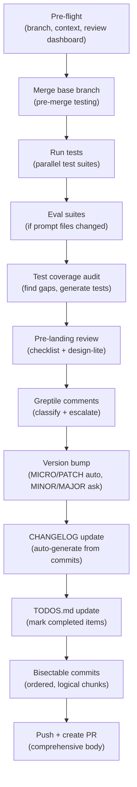
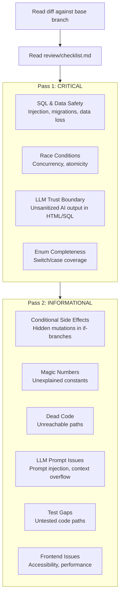
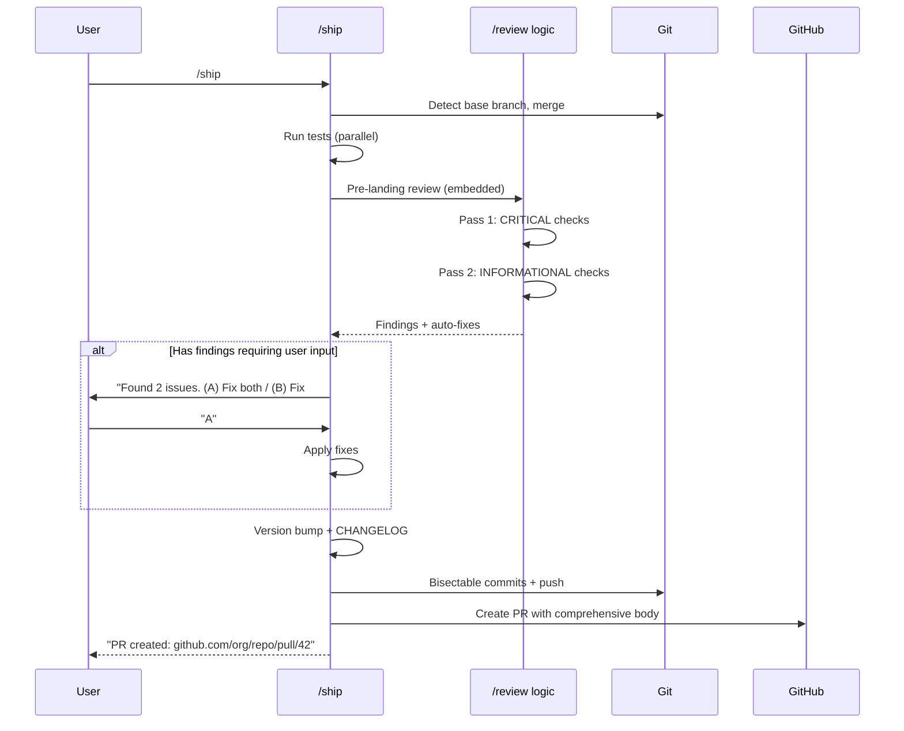

# Chapter 8: Ship & Review Pipeline

Welcome to the shipping pipeline — the fully automated workflow that takes your code from "done on a branch" to "merged PR with version bump, changelog, and tests passing." This is where the Release Engineer and Staff Engineer skills work together.

## What Problem Does This Solve?

Shipping code involves a surprising number of steps: syncing with the base branch, running tests, reviewing the diff, bumping the version, writing changelog entries, creating a PR with a good description. Each step is simple, but together they take 30-60 minutes and are easy to mess up (forgot to update CHANGELOG, wrong version bump, stale base branch).

The `/ship` and `/review` skills automate this entire flow, including the judgment calls (is this a PATCH or MINOR bump? should this lint warning block the PR?).

## The Ship Workflow (`/ship`)

`/ship` is the most complex skill in gstack. It orchestrates everything from pre-flight checks to PR creation.



### Step 1: Pre-flight

Check the branch state and gather context:
- Detect base branch (`main`, `master`, etc.)
- Review readiness dashboard (are plan reviews complete?)
- Uncommitted changes warning

### Step 2: Merge Base Branch

Fetch and merge the base branch for **pre-merge testing** — catch conflicts and integration issues before creating the PR:

```bash
git fetch origin <base>
git merge origin/<base>
```

If there are conflicts, the skill stops and asks for help.

### Step 3: Run Tests

Both test suites run in parallel:

```bash
# Example: Rails + Vitest
bundle exec rspec &
npx vitest run &
wait
```

The `{{TEST_BOOTSTRAP}}` placeholder handles test framework detection — it identifies whether the project uses Jest, Vitest, RSpec, pytest, etc. and generates the appropriate commands.

### Step 4: Eval Suites (Conditional)

If the diff touches prompt-related files (SKILL.md templates, browse commands, etc.), the skill runs eval suites. This catches subtle regressions where a prompt change affects agent behavior.

### Step 5: Test Coverage Audit

The skill maps code paths and user flows, then generates tests for any gaps. This uses the Completeness Principle — the marginal cost of writing 10 more tests is nearly zero, so the skill recommends full coverage.

### Step 6: Pre-landing Review

This is where `/review`'s logic is embedded. The skill reads the review checklist and applies it to the diff:

```
Pre-landing Review
├── CRITICAL (must fix before merge)
│   ├── SQL & Data Safety        ✅ No issues
│   ├── Race Conditions          ✅ No issues
│   ├── LLM Output Trust         ⚠️  1 finding (auto-fixed)
│   └── Enum Completeness        ✅ Checked 3 switch statements
│
├── INFORMATIONAL (consider fixing)
│   ├── Conditional Side Effects  ✅ Clean
│   ├── Magic Numbers            ⚠️  1 finding (deferred)
│   └── Test Gaps                ✅ Covered in Step 5
│
└── Design Review Lite           ✅ No frontend changes
```

### Step 7: Greptile Integration

If the project uses Greptile (AI code review), the skill fetches and classifies comments:

- **Fix**: Clear bug or issue → auto-fix
- **False Positive**: Not actually a problem → reply with explanation
- **Already Fixed**: Fixed in a previous step → reply noting the fix

### Step 8: Version Bump

The skill auto-decides between MICRO and PATCH bumps. For MINOR or MAJOR, it asks:

```
Version bump decision:
- Current: 0.6.3
- Changes: 2 new features, 1 bug fix, 0 breaking changes

Recommendation: PATCH → 0.6.4
(A) PATCH 0.6.4 — bug fix + small features
(B) MINOR 0.7.0 — significant new functionality
(C) MAJOR 1.0.0 — breaking changes or major milestone
```

### Step 9: CHANGELOG

Auto-generates changelog entries from commits, written in user-focused language (see CLAUDE.md's CHANGELOG style guidelines):

```markdown
## v0.6.4

- You can now import cookies from Brave browser in addition to Chrome, Arc, and Edge
- Fixed a bug where snapshot refs would go stale during SPA navigation without a full page reload
- The retro command now tracks individual contributor streaks across weeks
```

### Step 10: Bisectable Commits

Following gstack's commit philosophy, changes are split into logical, independently-revertable commits:

```
1. refactor: extract cookie decryption into shared module
2. feat: add Brave browser support to cookie-import-browser
3. fix: clear ref map on SPA pushState navigation
4. test: add regression tests for SPA ref staleness
5. docs: regenerate SKILL.md files
6. chore: bump VERSION to 0.6.4, update CHANGELOG
```

### Step 11: Push and Create PR

The skill pushes and creates a PR with a comprehensive body including:
- Summary of changes
- Test results
- Review findings and fixes
- Version bump rationale
- Review dashboard status

## The Review Workflow (`/review`)

`/review` is the standalone PR review skill. It's also embedded into `/ship` as the pre-landing review step.

### Two-Pass Analysis



### The Checklist (`review/checklist.md`)

The review checklist classifies every finding type as either:
- **AUTO-FIX**: The skill fixes it immediately (typos, simple refactors, missing null checks)
- **ASK**: The skill asks the user before changing (architecture decisions, behavior changes)
- **SUPPRESS**: Known false positives to ignore

### Design Review Lite

For PRs that touch frontend code, the review includes a lightweight design check:

```
Design Review Lite:
├── Visual consistency    ✅ Matches existing patterns
├── Responsive behavior   ⚠️  New modal not tested on mobile
├── Loading states        ✅ Spinner added
└── Empty states          ❌ No empty state for search results
```

This is generated by the `{{DESIGN_REVIEW_LITE}}` placeholder — a subset of the full `/design-review` skill focused on the most common issues.

### Enum Completeness (A Unique Check)

The review skill does something most linters can't — it reads code **outside the diff** to check enum completeness:

```typescript
// In the diff: new enum value added
enum Status { Active, Inactive, Suspended }

// NOT in the diff, but the review checks it:
// Does every switch(status) handle "Suspended"?
switch (user.status) {
  case Status.Active: ...
  case Status.Inactive: ...
  // Missing: Status.Suspended! ← Review catches this
}
```

This requires reading the full codebase, not just the diff — which is why it's a skill behavior rather than a lint rule.

## How Ship and Review Work Together



## The Document Release Step (`/document-release`)

After `/ship` creates the PR, `/document-release` runs as a follow-up to update documentation:

1. **Diff analysis**: What changed in the code?
2. **Per-file audit**: Is README accurate? ARCHITECTURE? CONTRIBUTING? CLAUDE.md?
3. **Auto-updates**: Factual corrections (changed function names, new commands)
4. **Ask about risky changes**: Narrative changes, philosophy updates, removals
5. **CHANGELOG polish**: Preserve content but improve wording
6. **Cross-doc consistency**: Do all docs agree on how things work?
7. **TODOS.md cleanup**: Mark completed items, capture new deferred work
8. **Commit**: Single docs commit added to the PR

Key rules:
- **Never clobber CHANGELOG** — only polish voice, never rewrite
- **Never bump VERSION without asking** — even if it looks obvious
- **Only auto-update clear factual corrections** — anything subjective gets an AskUserQuestion

## What's Next?

With shipping covered, let's look at the QA and design review skills that catch bugs and visual issues using the browse engine.

→ Next: [Chapter 9: QA & Design Review](09_qa_and_design_review.md)

