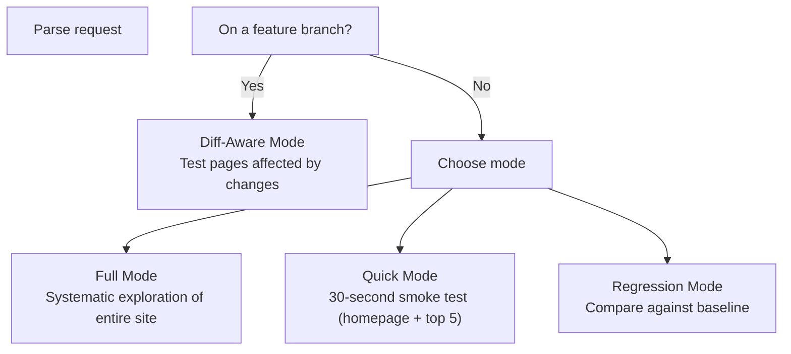
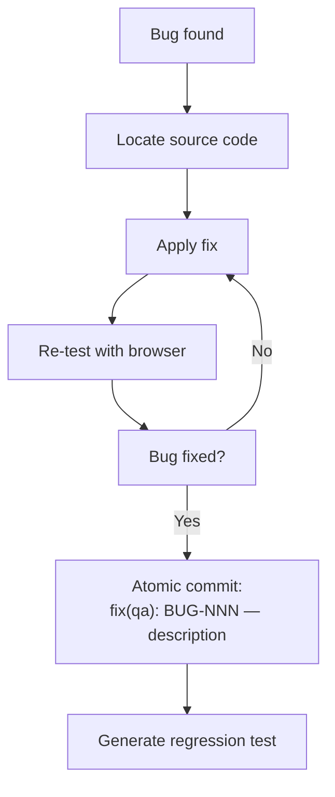
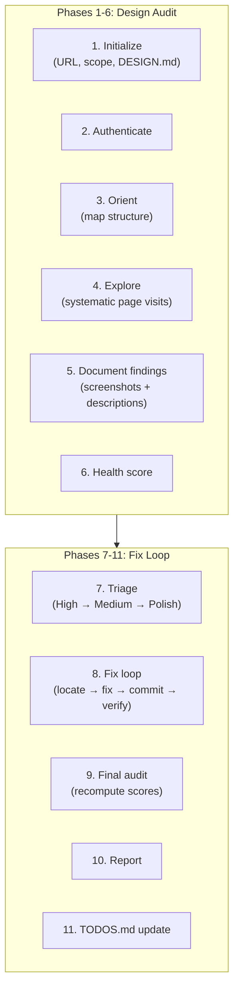
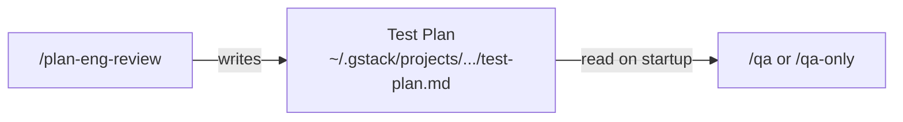

# Chapter 9: QA & Design Review

Welcome to the QA and design review skills — the "testing team" that uses real browser interactions to find bugs and visual issues. These skills combine the [browse engine](02_browse_engine.md) with structured methodologies to test your application the way a real user would.

## What Problem Does This Solve?

Unit tests verify that individual functions work correctly. Integration tests verify that components work together. But neither tells you whether a real user can actually log in, submit a form, or navigate to the settings page without encountering a broken button or a confusing layout.

The QA and design review skills fill this gap by:
- Launching a real browser and visiting your application
- Clicking buttons, filling forms, and navigating like a user would
- Taking screenshots at every step
- Producing structured reports with repro steps and severity ratings

## QA Skills: `/qa` and `/qa-only`

These two skills share the same methodology (via the `{{QA_METHODOLOGY}}` template placeholder) but differ in one key way:

| Skill | Finds Bugs | Fixes Bugs | Writes Tests |
|-------|-----------|-----------|-------------|
| `/qa` | Yes | Yes | Yes |
| `/qa-only` | Yes | **No** | **No** |

Use `/qa-only` when you want a read-only report (e.g., for a project you don't own). Use `/qa` when you want the agent to fix what it finds.

### Four Modes

Both skills support four testing modes:



**Diff-Aware** (the most common): Analyzes your branch's changes, identifies which pages/routes are affected, and focuses testing there. If you changed the checkout flow, it tests the checkout flow — not the about page.

### The Six Phases

The QA methodology runs in six phases:

#### Phase 1: Initialize
Create output directory (`.gstack/qa-reports/`), detect mode, parse URL and auth parameters.

#### Phase 2: Authenticate
If the app requires login, the skill either:
- Imports cookies from a real browser (`$B cookie-import-browser chrome`)
- Fills in the login form using provided credentials

```bash
$B goto https://myapp.com/login
$B snapshot -i
$B fill @e1 "test@example.com"
$B fill @e2 "password123"
$B click @e3       # "Sign In" button
$B snapshot -D     # Verify login succeeded
```

#### Phase 3: Orient
Map the application structure by exploring navigation:

```bash
$B goto https://myapp.com
$B snapshot -i         # See all interactive elements
$B links               # List all navigation links
```

This builds a mental model of the app's pages and routes.

#### Phase 4: Explore
Visit pages systematically, taking snapshots and looking for issues:

```bash
$B goto https://myapp.com/dashboard
$B snapshot
$B screenshot /tmp/qa/dashboard.png
# Check for console errors
$B console --errors
# Check for broken network requests
$B network
```

The agent looks for:
- **Functional bugs**: Buttons that don't work, forms that don't submit, broken navigation
- **Console errors**: Unhandled exceptions, failed API calls
- **Network errors**: 404s, 500s, failed fetches
- **Visual issues**: Missing elements, broken layouts (noted for design review)
- **State issues**: Loading spinners that never stop, empty states without messaging

#### Phase 5: Document Issues
For each bug found, the agent captures:

```markdown
## BUG-001: Submit button unresponsive on checkout page

**Severity:** High
**Page:** /checkout
**Repro steps:**
1. Navigate to /checkout
2. Fill in shipping address
3. Click "Place Order" (@e7)
4. Nothing happens — no loading state, no error, no redirect

**Expected:** Order confirmation page
**Actual:** Button click has no effect

**Screenshot:** /tmp/qa/bug-001-checkout.png
**Console:** TypeError: Cannot read properties of undefined (reading 'address')
```

#### Phase 6: Health Score
Compute an overall health score (0-100) based on:
- Number of bugs by severity
- Console error frequency
- Network failure rate
- Core flow completion rate

### `/qa` Fix Loop

The `/qa` skill (but not `/qa-only`) adds a fix loop after Phase 6:



Each fix gets an **atomic commit** (`fix(qa): BUG-NNN — description`) so fixes are independently revertable.

## Design Review: `/design-review`

While QA finds **functional** bugs, design review finds **visual** issues — spacing, alignment, color consistency, hierarchy, responsive behavior.

### The Audit Phases

The design review shares its methodology with `/plan-design-review` via the `{{DESIGN_METHODOLOGY}}` placeholder, but adds a **fix loop**:



### What Design Review Catches

| Category | Example Finding |
|----------|----------------|
| **Spacing** | "Card padding is 12px but design system specifies 16px" |
| **Typography** | "Heading uses 14px — should be 18px per the type scale" |
| **Color** | "Error text is #ff0000 but the design token is #DC2626" |
| **Hierarchy** | "Secondary action has same visual weight as primary" |
| **Responsive** | "Navigation overlaps content at 768px viewport" |
| **Empty States** | "No message when search returns zero results" |
| **Loading States** | "No skeleton/spinner while data loads" |
| **Accessibility** | "Button has no accessible label for screen readers" |
| **AI Slop** | "Generic card layout — not specific to the data being shown" |

### The Fix Loop (Phase 8)

For each finding, the design review:

1. **Locates the source**: Which CSS class? Which component file?
2. **Applies a minimal fix**: CSS-first, smallest possible change
3. **Commits atomically**: `style(design): FINDING-NNN — description`
4. **Verifies with screenshots**: Before and after

```bash
# Before fix
$B screenshot /tmp/design/finding-003-before.png

# After fix (CSS change applied)
$B reload
$B screenshot /tmp/design/finding-003-after.png
```

### Risk Heuristic

The design review has a built-in **risk accumulator** that prevents runaway fixes:

| Trigger | Risk Increase |
|---------|--------------|
| Each revert | +15% |
| Each component file change | +5% |
| After fix 10 | +1% per additional |
| Touching unrelated files | +20% |

**Hard stops:**
- Risk > 20% → stop fixing, report remaining as deferred
- Fix count > 30 → hard cap, stop regardless

If the risk gets too high, the skill defers remaining findings to TODOS.md for manual review.

### Self-Regulation

After each fix, the skill asks itself:
- "Am I confident this fix is correct?"
- "Did this change any file I didn't intend to?"
- "Is the before/after screenshot actually better?"

If the answer to any is "no," the fix is reverted and the finding is deferred.

## Browser-Based Testing Patterns

All three skills use common browser patterns:

### Pattern: Navigate → Snapshot → Interact → Verify

```bash
$B goto https://myapp.com/settings
$B snapshot -i                          # See what's interactive
$B click @e3                            # Click "Change Password"
$B snapshot -D                          # What changed?
$B fill @e4 "newpassword123"
$B click @e5                            # "Save"
$B snapshot -D                          # Verify success message
```

### Pattern: Responsive Testing

```bash
$B viewport 375x812                     # Mobile
$B screenshot /tmp/qa/settings-mobile.png
$B viewport 768x1024                    # Tablet
$B screenshot /tmp/qa/settings-tablet.png
$B viewport 1280x720                    # Desktop
$B screenshot /tmp/qa/settings-desktop.png
```

Or use the built-in responsive command:

```bash
$B responsive settings                  # Three screenshots in one command
```

### Pattern: Error Detection

```bash
$B goto https://myapp.com/broken-page
$B console --errors                     # Any JS errors?
$B network                              # Any failed requests?
$B is visible ".error-banner"           # Is an error shown to the user?
```

### Pattern: Form Validation

```bash
$B goto https://myapp.com/register
$B snapshot -s "form" -i                # Scope to the form
$B click @e5                            # Submit empty form
$B snapshot -D                          # Check for validation messages
$B fill @e1 "invalid-email"
$B click @e5                            # Submit with invalid data
$B snapshot -D                          # Check error handling
```

## How QA Skills Use the Test Plan

When `/plan-eng-review` generates a test plan artifact, QA skills consume it:



The test plan tells the QA skill:
- Which codepaths to focus on
- Expected behaviors to verify
- Edge cases to test
- Known risks to probe

## Output

QA reports are saved in two locations:
1. **Local**: `.gstack/qa-reports/` (for the current project)
2. **Project-scoped**: `~/.gstack/projects/{slug}/` (persistent across sessions)

Design review reports include the same plus:
- Before/after screenshots for each fix
- Git commits for each fix
- A summary of deferred findings added to TODOS.md

## What's Next?

Now let's look at the test infrastructure that validates gstack itself — the 3-tier system that catches broken skills before they ship.

→ Next: [Chapter 10: Test Infrastructure](10_test_infrastructure.md)

