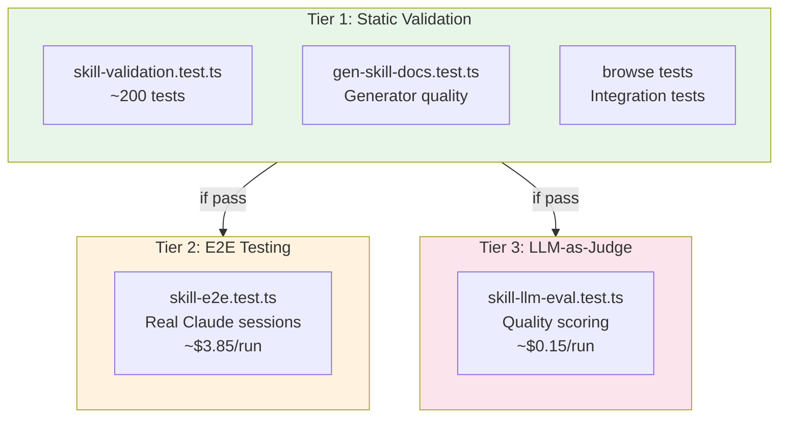
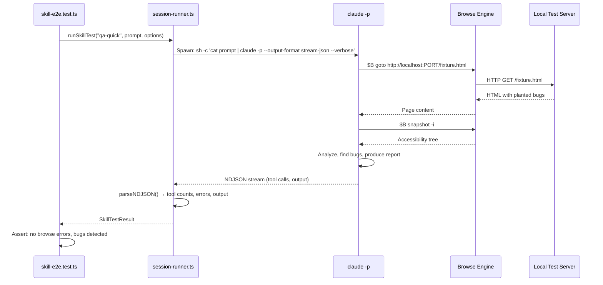
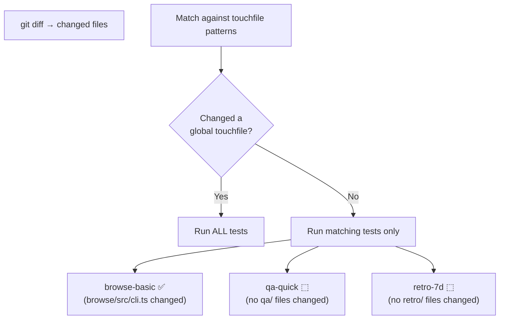
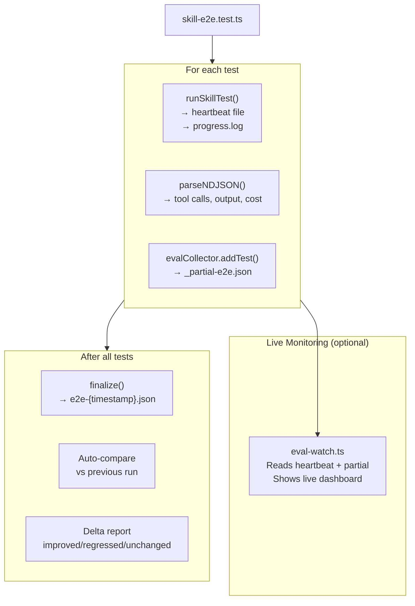

# Chapter 10: Test Infrastructure

Welcome to the final chapter — the test infrastructure that validates gstack itself. This is the system that ensures skills are correct, browse commands work, and AI agent behavior doesn't regress.

## What Problem Does This Solve?

Testing an AI-powered tool is uniquely challenging. You can't just assert "the output equals X" because AI outputs vary. You need:
- **Static validation** to catch syntax errors and invalid commands (fast, free)
- **End-to-end testing** to verify real Claude sessions produce correct behavior (slow, paid)
- **LLM-as-judge** to evaluate output quality when exact matching is impossible (medium, paid)

gstack's 3-tier test system addresses each need at the appropriate cost point.

## The Three Tiers



| Tier | What | Cost | Time | When |
|------|------|------|------|------|
| 1 | Static validation | Free | <2s | Every commit (`bun test`) |
| 2 | E2E with real Claude | ~$3.85/run | ~20min | Before shipping (`bun run test:e2e`) |
| 3 | LLM-as-judge | ~$0.15/run | ~30s | Before shipping (`bun run test:evals`) |

## Tier 1: Static Validation

### Skill Validation (`test/skill-validation.test.ts`)

This test parses every `$B` command in every SKILL.md file and validates them against the command registry:

```typescript
// Simplified from skill-parser.ts
function extractBrowseCommands(skillPath: string): BrowseCommand[] {
  const content = readFileSync(skillPath, 'utf-8');
  const commands: BrowseCommand[] = [];

  // Find all bash code blocks
  for (const block of extractBashBlocks(content)) {
    // Find all $B commands in each block
    for (const match of block.matchAll(/\$B\s+(\S+)/g)) {
      commands.push({
        command: match[1],
        line: getLineNumber(content, match.index),
        context: block,
      });
    }
  }
  return commands;
}
```

Then validation checks:

```typescript
function validateSkill(skillPath: string) {
  const commands = extractBrowseCommands(skillPath);

  return {
    valid: commands.filter(c => ALL_COMMANDS.has(c.command)),
    invalid: commands.filter(c => !ALL_COMMANDS.has(c.command)),
    snapshotFlagErrors: validateSnapshotFlags(commands),
    warnings: checkForHardcodedBranches(skillPath),
  };
}
```

**What it catches:**
- Typos in command names (`$B screensht` → "Unknown command: screensht")
- Invalid snapshot flags (`$B snapshot -x` → "Unknown flag: -x")
- Hardcoded branch names (`git merge main` → "Use dynamic detection")
- Missing commands after source changes

### Generator Quality (`test/gen-skill-docs.test.ts`)

This test validates that the template engine produces correct output:
- All placeholders are resolved (no `{{PLACEHOLDER}}` left in output)
- Generated files match what `gen-skill-docs` would produce (freshness check)
- Command tables include all registered commands
- Snapshot flag tables include all registered flags

### Browse Integration Tests (`browse/test/`)

These test the browse engine itself using local HTML fixtures:

```typescript
// Example: test clicking a button
test('click updates page content', async () => {
  await sendCommand('goto', [`http://localhost:${port}/counter.html`]);
  await sendCommand('click', ['#increment']);
  const result = await sendCommand('text', ['#count']);
  expect(result.output).toBe('1');
});
```

## Tier 2: E2E Testing

### How E2E Tests Work

E2E tests spawn **real Claude sessions** via `claude -p` and verify that the agent uses browse commands correctly:



### The Session Runner (`test/helpers/session-runner.ts`)

The session runner is the core of E2E testing:

```typescript
// Simplified from session-runner.ts
async function runSkillTest(name: string, prompt: string, options: TestOptions): Promise<SkillTestResult> {
  const proc = Bun.spawn(
    ['sh', '-c', `cat <<'PROMPT' | claude -p --output-format stream-json --verbose\n${prompt}\nPROMPT`],
    { stdout: 'pipe', stderr: 'pipe', timeout: options.timeout ?? 120_000 }
  );

  const lines: string[] = [];
  for await (const line of readLines(proc.stdout)) {
    lines.push(line);
    // Heartbeat: write progress to file for live monitoring
  }

  const parsed = parseNDJSON(lines);

  return {
    output: parsed.finalOutput,
    toolCalls: parsed.toolCalls,
    browseErrors: detectBrowseErrors(parsed),
    exitReason: parsed.exitReason,
    duration: Date.now() - start,
    costEstimate: parsed.costEstimate,
  };
}
```

### NDJSON Parsing

Claude's `--output-format stream-json` outputs Newline-Delimited JSON. The `parseNDJSON()` function is a **pure function** (no I/O, independently testable) that extracts:

```typescript
interface ParsedTranscript {
  turnCount: number;
  toolCallCount: number;
  toolCalls: Array<{
    tool: string;
    input: any;
    output: string;
  }>;
  finalOutput: string;
  exitReason: string;
  costEstimate: number;
}
```

### Browse Error Detection

The runner scans tool call outputs for known error patterns:

```typescript
const BROWSE_ERROR_PATTERNS = [
  'Unknown command',
  'Unknown snapshot flag',
  'ERROR: browse binary not found',
  'Ref .* is stale',
  'Timed out',
];
```

If any of these appear in the transcript, the test fails — the agent used an invalid command or encountered a browse engine error.

### Planted-Bug Testing

Some E2E tests use **planted bugs** — HTML fixtures with known issues that the QA agent should find:

```html
<!-- test/fixtures/qa-eval.html -->
<form id="checkout">
  <input type="email" required>
  <button type="submit" disabled>Pay Now</button>  <!-- BUG: button always disabled -->
</form>
<div class="price">$99.99</div>
<div class="total">$89.99</div>  <!-- BUG: total doesn't match price -->
```

The test verifies that the agent detects these bugs:

```typescript
test('qa finds planted bugs', async () => {
  const result = await runSkillTest('qa-quick', prompt, { timeout: 180_000 });
  expect(result.browseErrors).toHaveLength(0);

  // LLM judge evaluates the report against ground truth
  const score = await outcomeJudge(groundTruth, result.output);
  expect(score.detection_rate).toBeGreaterThanOrEqual(0.6);
});
```

## Tier 3: LLM-as-Judge

### How It Works

When exact output matching is impossible (QA reports, design reviews), gstack uses **Claude as a judge** to evaluate output quality:

```typescript
// From llm-judge.ts
async function judge(section: string, content: string): Promise<JudgeScore> {
  return callJudge({
    prompt: `Rate this ${section} on a scale of 1-5 for:
      - Clarity: Is it easy to understand?
      - Completeness: Does it cover all relevant aspects?
      - Actionability: Can someone act on this information?

      Content to evaluate:
      ${content}`,
    schema: {
      clarity: 'number (1-5)',
      completeness: 'number (1-5)',
      actionability: 'number (1-5)',
      reasoning: 'string',
    },
  });
}
```

### Outcome Judging

For planted-bug tests, the outcome judge evaluates whether the QA agent found the right bugs:

```typescript
async function outcomeJudge(groundTruth: GroundTruth, report: string): Promise<OutcomeScore> {
  return callJudge({
    prompt: `Given these known bugs:
      ${JSON.stringify(groundTruth.bugs)}

      And this QA report:
      ${report}

      Evaluate:
      - detection_rate: What fraction of bugs were found? (0.0 - 1.0)
      - false_positives: How many non-bugs were reported as bugs?
      - evidence_quality: How well-supported are the findings? (1-5)`,
  });
}
```

### The `callJudge` Helper

```typescript
// From llm-judge.ts — generic judge with retry
async function callJudge<T>(options: { prompt: string; schema: any }): Promise<T> {
  const response = await anthropic.messages.create({
    model: 'claude-sonnet-4-6',  // Fast, cheap, good enough for judging
    max_tokens: 1024,
    messages: [{ role: 'user', content: options.prompt }],
  });

  // Retry on 429 (rate limit)
  // Parse structured response
  return parsed as T;
}
```

## Diff-Based Test Selection

E2E tests are expensive (~$3.85/run). To avoid running all tests on every change, gstack uses **diff-based selection**:

### How It Works

Each test declares its **file dependencies** in `test/helpers/touchfiles.ts`:

```typescript
export const E2E_TOUCHFILES: Record<string, string[]> = {
  'browse-basic': ['browse/src/**'],
  'qa-quick': ['qa/**', 'browse/src/**'],
  'design-consultation-core': ['design-consultation/**'],
  'ship-basic': ['ship/**', 'review/**', 'bin/**'],
  'retro-7d': ['retro/**'],
};

export const GLOBAL_TOUCHFILES = [
  'test/helpers/session-runner.ts',
  'test/helpers/eval-store.ts',
  'scripts/gen-skill-docs.ts',
  'SKILL.md',
];
```

When you run `bun run test:evals`, the system:

1. Computes `git diff` against the base branch
2. Matches changed files against touchfile patterns
3. Runs only tests whose dependencies changed
4. **Global touchfiles trigger all tests** — if you change `session-runner.ts`, every E2E test runs



### Preview Selection

```bash
bun run eval:select    # Show which tests would run
```

### Force All Tests

```bash
EVALS_ALL=1 bun run test:evals    # Override selection
bun run test:evals:all             # Same thing
```

## The Eval Store

Test results are persisted for comparison and trend analysis:

### Storage

```
~/.gstack-dev/evals/
├── e2e-20260317-143022.json       # Timestamped eval run
├── e2e-20260318-091500.json
├── _partial-e2e.json              # In-progress (updated after each test)
└── llm-judge-20260318-092000.json
```

### The `EvalCollector` Class

```typescript
// From eval-store.ts
class EvalCollector {
  private results: TestResult[] = [];

  addTest(result: TestResult) {
    this.results.push(result);
    this.savePartial();  // Atomic write to _partial-{tier}.json
  }

  finalize(): string {
    const filename = `${this.tier}-${timestamp()}.json`;
    writeFileSync(path.join(evalDir, filename), JSON.stringify(this.results));
    return filename;
  }
}
```

### Comparison

After a run, results are automatically compared to the previous run:

```typescript
interface ComparisonResult {
  before: EvalRun;
  after: EvalRun;
  tests: Array<{
    name: string;
    status_change: 'improved' | 'regressed' | 'unchanged';
    cost_delta: number;
    tool_count_delta: number;
  }>;
}
```

### Analysis Tools

```bash
bun run eval:list      # List all runs
bun run eval:compare   # Compare last two runs
bun run eval:summary   # Aggregate stats across all runs
```

## The E2E Failure Blame Protocol

From CLAUDE.md — a critical process rule:

> **Never claim "not related to our changes" without proving it.**

When an E2E test fails:

1. **Run the same test on the base branch** — does it fail there too?
2. **If it passes on base but fails on branch** — it IS your change. Trace the blame.
3. **If you can't run on base** — say "unverified — may or may not be related"

This matters because of **invisible couplings**:
- A preamble text change affects agent behavior
- A new helper changes timing
- A regenerated SKILL.md shifts prompt context
- These effects are non-obvious and can't be dismissed without evidence

## Observability Pipeline

Here's how all the pieces connect during an eval run:



## Putting It All Together

Here's the recommended testing workflow:

```bash
# 1. Free tests — run on every change
bun test

# 2. Check which E2E tests would run
bun run eval:select

# 3. Run diff-based E2E tests before shipping
bun run test:evals

# 4. (Optional) Run all tests for confidence
bun run test:evals:all

# 5. Compare results with previous run
bun run eval:compare

# 6. Ship with confidence
/ship
```

The 3-tier system means you get fast feedback on every change (Tier 1), thorough validation before shipping (Tiers 2+3), and cost-efficient test selection that only runs what's needed.

## Congratulations!

You've completed the gstack tutorial! You now understand:

1. [**Architecture**](01_architecture.md) — How gstack turns Claude Code into a virtual team
2. [**Browse Engine**](02_browse_engine.md) — The persistent headless browser at the foundation
3. [**Snapshot & Refs**](03_snapshot_and_refs.md) — How AI agents see and interact with pages
4. [**Command System**](04_command_system.md) — The full vocabulary of browser operations
5. [**Skill System**](05_skill_system.md) — Markdown-based workflow prompts for each role
6. [**Template Engine**](06_template_engine.md) — Build-time generation that keeps docs in sync
7. [**Planning Skills**](07_planning_skills.md) — CEO, Eng, and Design plan reviews
8. [**Ship & Review**](08_ship_and_review.md) — The automated shipping pipeline
9. [**QA & Design Review**](09_qa_and_design_review.md) — Real browser testing and visual QA
10. [**Test Infrastructure**](10_test_infrastructure.md) — 3-tier validation for the tool itself

Happy shipping!

