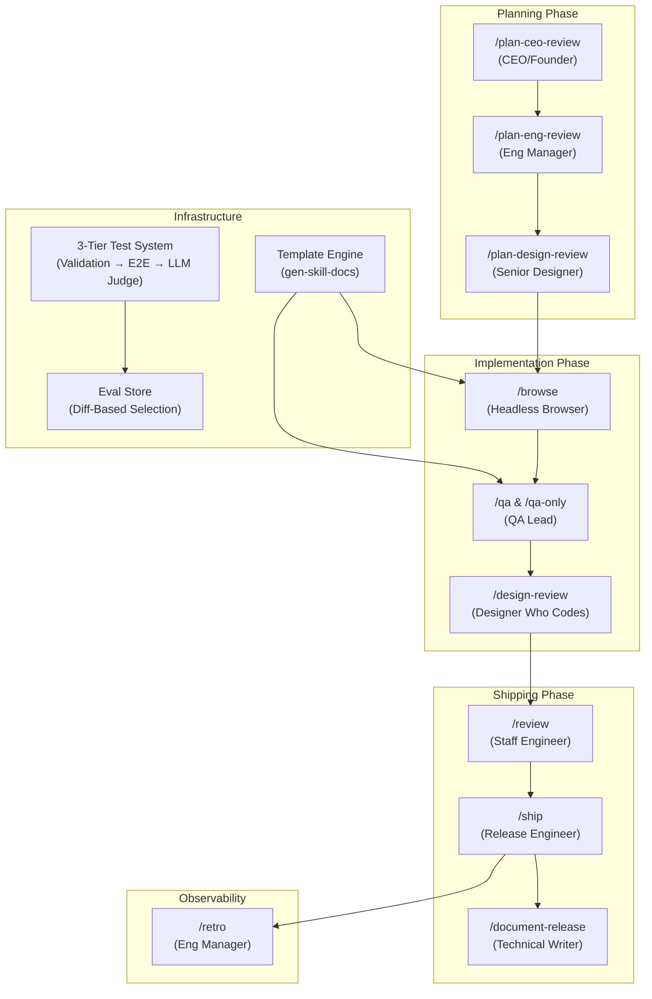

# Tutorial: gstack

gstack[View Repo](https://github.com/anthropics/gstack) is an open-source software factory that turns Claude Code into a virtual engineering team. It provides a persistent headless browser CLI (~100ms per command), 14 specialized skills (slash commands) that operate as different roles — CEO, Eng Manager, Designer, QA Lead, Release Engineer — and a template system that keeps documentation in sync with source code automatically.

Think of gstack as a crew of AI specialists, each with a well-defined role and workflow, orchestrated through Markdown-based skill templates and powered by a fast, Playwright-based browser engine for real-world testing.

## Chapters

1. [Architecture Overview](01_architecture.md) — The big picture: how gstack turns Claude Code into a virtual team
2. [Browse Engine](02_browse_engine.md) — The persistent headless browser CLI at the heart of gstack
3. [Snapshot & Ref System](03_snapshot_and_refs.md) — How gstack sees and interacts with web pages
4. [Command System](04_command_system.md) — The full command registry: read, write, and meta commands
5. [Skill System](05_skill_system.md) — Markdown-based workflow prompts that define each team role
6. [Template Engine](06_template_engine.md) — How `.tmpl` files become live skill documentation
7. [Planning Skills](07_planning_skills.md) — CEO, Eng Manager, and Designer plan reviews
8. [Ship & Review Pipeline](08_ship_and_review.md) — From code to PR: the automated shipping workflow
9. [QA & Design Review](09_qa_and_design_review.md) — Finding bugs and fixing design issues with real browsers
10. [Test Infrastructure](10_test_infrastructure.md) — The 3-tier validation system: static, E2E, and LLM-as-judge

