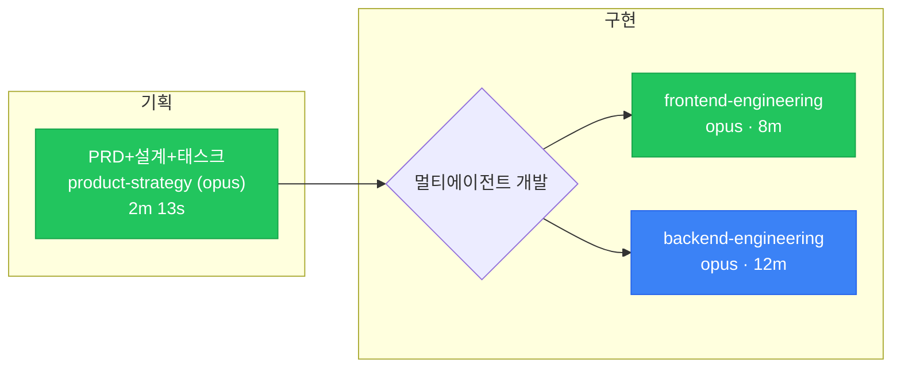
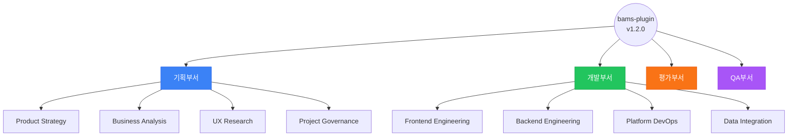

# Bams Viz

파이프라인 실행을 시각화합니다. 에이전트 호출 관계, 타임라인, 실시간 상태를 볼 수 있습니다.

입력: $ARGUMENTS

## 모드 결정

$ARGUMENTS를 분석하여 모드를 결정합니다:

- **`org`** → 조직도 모드
- **`live`** → 실시간 대시보드 모드
- **그 외 (slug 또는 비어있음)** → 정적 시각화 모드

---

## 모드 1: 정적 시각화 (`/bams:viz` 또는 `/bams:viz <slug>`)

### Step 1: slug 결정

$ARGUMENTS가 비어있으면:
1. Glob으로 `.crew/artifacts/pipeline/*-events.jsonl` 파일을 검색합니다.
2. 파일이 없으면: "이벤트 파일이 없습니다. 파이프라인을 실행한 후 다시 시도하세요." 후 종료.
3. 파일이 1개면: 자동 선택.
4. 파일이 여러 개면: AskUserQuestion으로 선택.

$ARGUMENTS가 slug이면: `.crew/artifacts/pipeline/{slug}-events.jsonl` 존재 확인.

### Step 2: 이벤트 파싱

이벤트 파일을 Read로 읽고, 각 줄을 JSON으로 파싱합니다.
파싱 실패 줄은 건너뛰고 경고를 출력합니다.

이벤트에서 다음을 추출합니다:
- 파이프라인 메타: type, status, 시작/종료 시각
- Step 목록: 번호, 이름, Phase, 상태, 시간
- 에이전트 목록: call_id, type, model, 상태, 시간, 병렬 그룹

### Step 3: Mermaid DAG 생성

에이전트 호출 관계를 Mermaid flowchart로 출력합니다:

```
## Pipeline DAG: {slug}


```

노드 스타일:
- **done/success**: `fill:#22c55e` (녹색)
- **fail**: `fill:#ef4444` (적색)
- **skipped**: `fill:#9ca3af` (회색)
- **running**: `fill:#3b82f6` (파랑)
- **pending**: `fill:#e5e7eb` (연회색)

병렬 에이전트: fork 노드(`{}` 다이아몬드)에서 분기하여 같은 rank에 배치.

### Step 4: Mermaid 간트 차트 생성

타임라인을 Mermaid gantt로 출력합니다:

```
## Timeline: {slug}

```mermaid
gantt
  title {type}: {slug}
  dateFormat YYYY-MM-DDTHH:mm:ss
  axisFormat %H:%M
  section 기획
  product-strategy (opus)    :done, ps, {startedAt}, 133s
  business-analysis (opus)   :done, ba, {startedAt}, 105s
  frontend-engineering (sonnet) :done, fe, {startedAt}, 80s
  section 구현
  frontend-engineering (opus) :active, fe2, {startedAt}, 480s
  backend-engineering (opus)  :done, be2, {startedAt}, 720s
```
```

병렬 에이전트: 동일 시작 시각으로 겹쳐 표시.
fail: `crit` 태그. running: `active` 태그.

### Step 5: 요약 통계

```
Pipeline: {type} — {slug}
상태: {status}
시작: {startedAt}
소요: {duration}
Steps: {completed}/{total} done, {failed} fail, {skipped} skipped
에이전트 호출: {agent_count}회 (병렬 최대 {max_parallel}개)
```

---

## 모드 2: 조직도 (`/bams:viz org`)

### Step 1: jojikdo.json 로딩

Glob으로 `references/jojikdo.json` 검색. 없으면 에러.

### Step 2: Mermaid 조직도 생성

4부서 16에이전트의 관계를 flowchart로 출력합니다:

```
## Bams Agent Organization


```

`agent_calls` 정보가 있으면 에이전트 간 협업 관계도 점선 화살표(`-.->`)로 표시.

---

## 모드 3: 실시간 대시보드 (`/bams:viz live`)

### Step 1: Node.js 확인

Bash로 `node --version` 실행. 18 미만이면:
"Node.js 18 이상이 필요합니다." 후 종료.

### Step 2: 의존성 확인

Bash로 `ls tools/bams-viz/node_modules/.package-lock.json 2>/dev/null` 확인.
없으면:
```bash
cd tools/bams-viz && npm install 2>&1
```

### Step 3: 서버 시작

```bash
node tools/bams-viz/server.js &
```

### Step 4: URL 안내

```
bams-viz 실시간 대시보드
══════════════════════════════════════
URL: http://localhost:3333
감시: .crew/artifacts/pipeline/

3개 뷰:
  DAG      — 에이전트 호출 관계 + 상태
  Timeline — 수평 간트 차트 (병렬 구간 강조)
  Logs     — 이벤트 실시간 스트림 + 필터

종료: Ctrl+C 또는 /bams:viz stop
```

---

## 모드 4: 서버 종료 (`/bams:viz stop`)

```bash
pkill -f "bams-viz/server.js" 2>/dev/null || echo "서버가 실행 중이 아닙니다."
```
